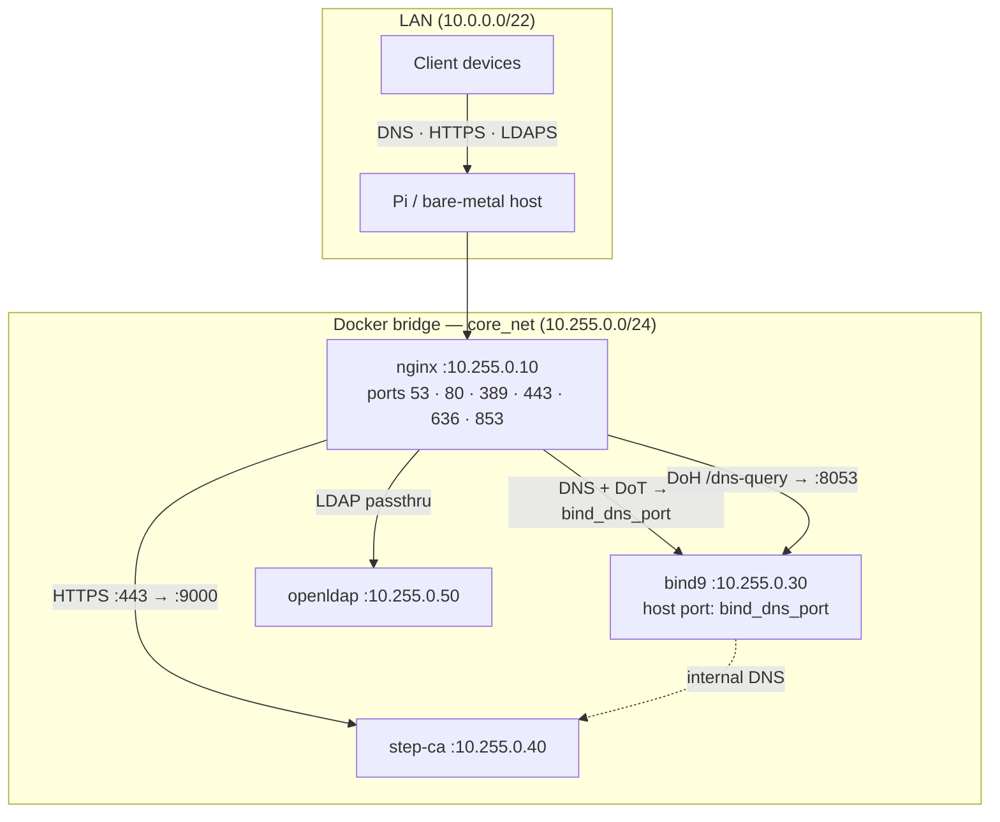
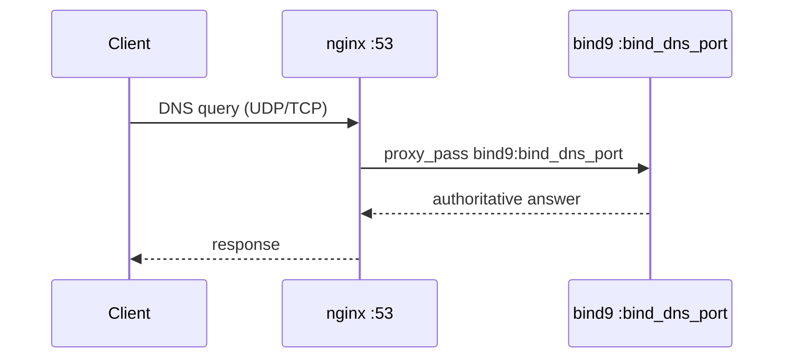
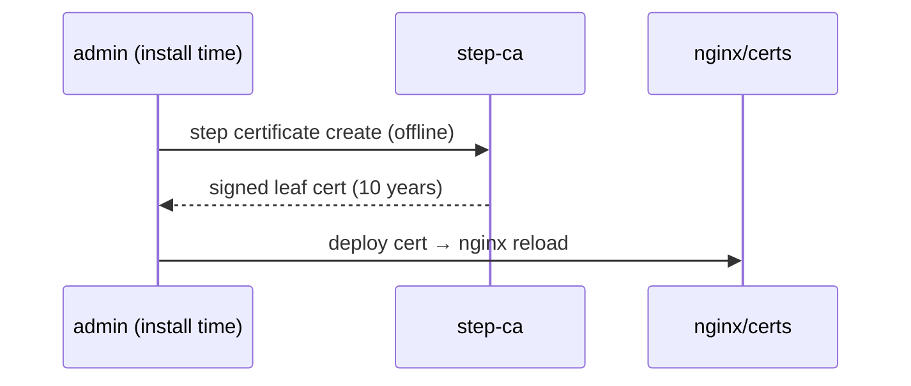

# core-template

> Ansible-driven home lab infrastructure: authoritative DNS, internal PKI, LDAP, and TLS — deployable locally or remotely, with offline support.

---

## Table of Contents

- [Synopsis](#synopsis)
- [Architecture](#architecture)
- [Installation](#installation)
  - [Prerequisites](#prerequisites)
  - [Offline Deployments](#offline-deployments)
  - [Configure vars](#configure-vars)
  - [Generate PKI (one-time, before install)](#generate-pki-one-time-before-install)
  - [Run the Installer](#run-the-installer)
- [Operations](#operations)
  - [Setup Modes](#setup-modes)
  - [Health Checks](#health-checks)
  - [Live Configuration Changes](#live-configuration-changes-modifysh)
    - [TSIG Key Management](#tsig-key-management)
    - [Certificate Minting](#certificate-minting)
    - [DNS Record Management](#dns-record-management)
  - [Ansible Tags Reference](#ansible-tags-reference)
  - [Service Ports](#service-ports)
- [Maintenance and Updates](#maintenance-and-updates)
  - [Updating Scripts](#updating-scripts)
  - [Rollback](#rollback)
  - [Uninstall](#uninstall)
  - [Version Tracking](#version-tracking)
- [Reference](#reference)
  - [PKI Chain](#pki-chain)
  - [DNS Architecture](#dns-architecture)
  - [Certificate Relay](#certificate-relay)
  - [Jinja2 Templates](#jinja2-templates)
  - [Customization Checklist](#customization-checklist)
- [Gaps and Next Tasks](#gaps-and-next-tasks)

---

## Synopsis

**core-template** is a template repository that provisions a self-contained home lab core stack via a single `setup.sh` invocation. It orchestrates 11 Ansible playbooks (sections 00–10) in sequence, standing up:

| Service | Container | Purpose |
|---------|-----------|---------|
| **BIND9** | `bind9` | Authoritative DNS + DNS-over-HTTPS + DNS-over-TLS |
| **nginx** | `nginx` | Reverse proxy — DNS/DoT/DoH/LDAP/HTTPS |
| **Step-CA** | `step-ca` | Internal PKI — root CA → intermediate → ACME |
| **OpenLDAP** | `openldap` | Directory services |

Everything is rendered from Jinja2 templates. User-facing settings live in `custom-vars.yaml` (repo root); infrastructure defaults live in `core/advanced-vars.yaml`. Secrets (CA password, TSIG keys) are pre-generated by `01-handle-vars.yml` into a git-ignored `core-secrets.yml` before rendering begins. Playbook `02-render-jinja.yml` merges all three sources through `core/jinja/vars.yaml.j2` and writes a resolved `vars.yaml` to `/tmp/core-template-render`. `04-target-file-structure.yml` copies it to the target alongside all other rendered outputs.

---

## Architecture



### Request flow — DNS



### Request flow — TLS certificate issuance



---

## Installation

### Prerequisites

Prerequisites are split into two categories:

**Local** — needed on the machine running `setup.sh`:

| Tool | Notes |
|------|-------|
| Ubuntu 24.04 LTS | The controller machine |
| Ansible 2.17+ | Installed automatically by `setup.sh` if missing (via PPA or offline bundle) |
| Ansible collections | `community.docker`, `community.general`, `ansible.posix` — installed automatically |
| `rsync`, `ssh-client` | Required for remote targets and `--export` |

**Remote** — needed on the target machine (installed automatically by the Ansible playbook):

| Component | Notes |
|-----------|-------|
| Ubuntu 24.04 LTS | The deployment target |
| Docker Engine 26+ | Installed by the playbook |
| `docker compose` v2 | Installed by the playbook |
| `python3-docker` | Required for Ansible Docker modules |
| System packages | `acl`, `openssl`, `ca-certificates`, `ufw`, etc. |
| Docker images | `nginx`, `ubuntu/bind9`, `smallstep/step-ca`, `core-alpine-tools` (pre-built — alpine + easy-rsa + openssl) |

For remote targets, SSH access and `sudo` rights are required. `setup.sh` handles SSH key distribution automatically on the first run.

---

### Offline Deployments

**Step 1** — on an internet-connected Ubuntu 24.04 machine, stage the bundles:

```bash
sudo ./offline.sh --stage
# Downloads APT packages, Docker images, and Ansible collections.
# Scans with ClamAV if installed (skipped with a warning if not).
# Prompts for the output directory, then produces two bundles:
#   core-template-controller-<timestamp>.zip  — Ansible + collections (run on Ansible host)
#   core-template-target-<timestamp>.zip      — system/Docker packages + images (installed on target)
```

**Step 2** — transfer both zips to the air-gapped environment.

**Step 3** — on the Ansible host, run the installer pointing at both bundles:

```bash
# Local target (Ansible host = deployment target)
sudo ./setup.sh --prereqs ./core-template-controller-<timestamp>.zip \
                --prereqs-target ./core-template-target-<timestamp>.zip

# Remote target (Ansible host and target are separate machines)
sudo ./setup.sh --prereqs ./core-template-controller-<timestamp>.zip \
                --prereqs-target ./core-template-target-<timestamp>.zip \
                --target 192.168.1.5

# If Ansible is already installed on the host, skip the controller bundle
sudo ./setup.sh --offline --prereqs-target ./core-template-target-<timestamp>.zip
```

`--prereqs` installs Ansible and collections locally from the controller bundle. `--prereqs-target` passes the target bundle to Ansible so the playbook installs remote packages and loads Docker images without network access. `--offline` skips the external DNS check without installing local prerequisites.

> **ClamAV:** if `clamav` is installed on the staging machine, `offline.sh --stage` will run `freshclam` and scan all downloaded files before packaging. The scan result (`CLEAN`, `THREATS FOUND`, or `SKIPPED`) is embedded in `scan-results.txt` inside the zip. `setup.sh --prereqs` reads that result and warns (with a confirmation prompt) if the bundle was flagged.

---

### Configure vars

Variables are split across two files:

- **`custom-vars.yaml`** (repo root) — user-facing settings: domain, IPs, DNS records, LDAP, TSIG keys, PKI identity. Edit this file to customise your deployment.
- **`core/advanced-vars.yaml`** — infrastructure defaults: `deploy_base_dir`, Docker image refs, port numbers, PKI lifetimes. Rarely changed.

`01-handle-vars.yml` generates secrets (CA password, one TSIG secret per key) and writes them to `core-secrets.yml` (git-ignored) on the first run; existing secrets are preserved on re-runs. `02-render-jinja.yml` then loads `custom-vars.yaml`, `advanced-vars.yaml`, and `core-secrets.yml`, renders `core/jinja/vars.yaml.j2`, and writes the fully-resolved result to `/tmp/core-template-render/vars.yaml`. All subsequent playbooks read from that rendered file.

Minimum required changes in `custom-vars.yaml`:

```yaml
# ── GLOBAL ──────────────────────────────────────────────────────────────────
domain: home                    # your internal TLD  (e.g. "lab", "internal")
system_timezone: America/New_York

# ── NETWORK ─────────────────────────────────────────────────────────────────
lan_cidr: 10.0.0.0/22           # your LAN subnet
lan_gateway: 10.0.0.1
dns_server: 10.0.0.1            # used during bootstrap before BIND9 starts
pi_core_ip: 10.0.3.53           # host machine IP on the LAN

# ── PKI ─────────────────────────────────────────────────────────────────────
acme_email: admin@email.internal

# ── DNS RECORDS ─────────────────────────────────────────────────────────────
dns:
  home:
    A:
    - { name: pi-core, ip: 10.0.3.53 }
    - { name: nas,     ip: 10.0.3.10 }
    CNAME:
    - { name: dns,  canonical: pi-core }
    - { name: ldap, canonical: pi-core }
    - { name: ca,   canonical: pi-core }
```

Key tunables with their defaults:

| Variable | Default | Description |
|----------|---------|-------------|
| `bind_dns_port` | `5353` | Host-facing BIND9 port (host-side access, coexistence with other resolvers) |
| `bind9_doh_port` | `8053` | BIND9 plain-HTTP DoH port (nginx terminates TLS) |
| `stepca_port` | `9000` | Step-CA HTTPS port |

> **`bind_dns_port`** is intentionally configurable so you can run another DNS resolver on the host simultaneously (e.g. Pi-hole, Unbound). Set this to any unused port and BIND9 will bind there without conflicting. nginx always proxies public port 53 → `bind9:bind_dns_port`.

---

### Generate PKI (one-time, before install)

The root CA and intermediate CA must be generated **offline** before running the installer. The root CA key never touches the target host.

```bash
bash core/pki/rootca.sh init
```

This writes four files to `core/pki/output/` (gitignored):

| File | Purpose | Deploy to target? |
|------|---------|------------------|
| `root_ca.key` | Root CA private key | **No** — keep offline or destroy |
| `root_ca.crt` | Root CA certificate | Yes (trust anchor for all services) |
| `intermediate_ca.key` | Intermediate CA private key | Yes (step-ca signs certs with this) |
| `intermediate_ca.crt` | Intermediate CA certificate | Yes (presented in TLS chains) |

**Key generation options** — edit `core/advanced-vars.yaml` before running:

```yaml
cert_root_key_type: rsa        # rsa | ec | ed25519
cert_root_key_param: '4096'    # RSA: 2048/3072/4096 | EC: P-256/P-384/P-521 | Ed25519: (ignored)
```

**Providing your own root CA key:** Place a PEM-format private key at `core/pki/output/root_ca.key` before running `rootca.sh init`. Generation is skipped if the file already exists. Supported types: RSA (any bit size), EC (P-256/P-384/P-521), Ed25519.

After `init`, verify the chain:

```bash
bash core/pki/rootca.sh verify
```

The installer (`core-config.yml`) reads from `core/pki/output/` automatically. Override the path with `-e pki_artifacts_dir=/path/to/certs`.

---

### Run the Installer

**Local install (most common):**

```bash
sudo ./setup.sh
```

**Local install + start services immediately:**

```bash
sudo ./setup.sh --start
```

**Remote install:**

```bash
sudo ./setup.sh --target 192.168.1.5
sudo ./setup.sh --target 192.168.1.5 --ssh-user myuser --start
```

On the first remote run, `setup.sh` will:
1. Generate `~/.ssh/id_ed25519` if no keypair exists
2. Trust the remote host key (`~/.ssh/known_hosts`)
3. Use `ssh-copy-id` to authorize the key (prompts for the remote password once)
4. Prompt for the remote sudo password before Ansible runs

After install, start services if you skipped `--start`:

```bash
docker compose -f /opt/core/docker-compose.yml up -d
```

---

## Operations

### Setup Modes

```bash
sudo ./setup.sh [mode] [flags]
```

| Mode | Description |
|------|-------------|
| *(default)* | Full install — bootstraps Ansible, runs the entire 11-section playbook (00–10) |
| `--update` | Safe update — re-renders scripts and static files only; never overwrites live service configs unless `--force` is added |
| `--rollback` | Restore the most recent pre-update archive snapshot (interactive) |
| `--uninstall` | Stop containers, remove service accounts and project directories (interactive) |
| `--custom --tags <tag>` | Run specific playbook sections by tag |

**Flags:**

| Flag | Description |
|------|-------------|
| `--target <ip>` | Deploy to a remote host |
| `--ssh-user <user>` | SSH username (defaults to invoking user) |
| `--prereqs <path>` | Controller bundle zip or directory (from `offline.sh --stage`); installs Ansible + collections locally |
| `--prereqs-target <path>` | Target bundle zip or directory; passed to Ansible to install packages and load images on the target without internet |
| `--offline` | Skip external DNS resolution check (implied by `--prereqs` / `--prereqs-target`) |
| `--start` | Run `docker compose up -d` after install |
| `--export [path]` | Save built configs to `./builds/` (or specified path) |
| `--check` | Show what would change without applying |
| `--review` | Show full file diffs without applying (update mode) |
| `--apply` | Apply without interactive prompting |
| `--force` | Overwrite live configs in addition to scripts (update mode — use carefully) |
| `--version` / `-v` | Print version info |

**Common examples:**

```bash
sudo ./setup.sh --update                   # Preview script changes, prompt to apply
sudo ./setup.sh --update --review          # Show full diffs, don't apply
sudo ./setup.sh --update --apply           # Apply silently (CI-friendly)
sudo ./setup.sh --update --force --apply   # Overwrite everything, including configs
sudo ./setup.sh --export                   # Install + save build archive to ./builds/
sudo ./setup.sh --custom --tags pki        # Re-run PKI section only
sudo ./setup.sh --custom --tags service-certs  # Re-issue offline Step-CA certs for core services
```

---

### Live Configuration Changes (`manage.sh`)

Use `core/manage.sh` for post-install changes to DNS records, TSIG keys, and certificates — no full redeploy needed.

```bash
sudo bash core/manage.sh [mode] [flags]
```

All modes support `--target <ip>` and `--ssh-user <user>` for remote operations.

#### TSIG Key Management

TSIG keys grant named DNS update rights to external services (NAS, reverse proxies, other hosts) for specific hostnames only.

```bash
# Interactive — prompts for key name, domain, and hostnames to allow
sudo bash core/manage.sh --tsig-keys

# List all active keys and their per-record grants
sudo bash core/manage.sh --list-tsig

# Remove a key by name
sudo bash core/manage.sh --remove-tsig acme_nas-proxy
```

All TSIG keys — including the primary ACME key — are defined in a single `tsig_keys` list in `vars.yaml`. The entry with `primary: true` is the primary ACME key for Step-CA's DNS-01 provisioner, managed by the installer. All other entries are applied by `manage.sh --tsig-keys`.

```yaml
tsig_keys:
- name: acme_dns-01       # primary ACME key — managed by installer
  algorithm: hmac-sha256
  domain: '{{ domain }}'
  primary: true
- name: acme_nas-proxy    # extra key — applied by manage.sh
  algorithm: hmac-sha256
  domain: home
  records:
  - nas-apps
  - jellyfin
  - sonarr
```

Each non-primary key generates:
- An entry in `named.conf.keys` with a random 256-bit secret
- Per-record `update-policy` grants in `named.conf.zones`
- A `rfc2136.ini` credentials file for the consuming service

#### Certificate Minting

Mint TLS certificates for services outside this stack (NAS apps, VMs, etc.).

```bash
# Interactive
sudo bash core/manage.sh --mint-certs

# Non-interactive — mints all entries in extra_certs from vars.yaml
sudo bash core/manage.sh --mint-certs --apply

# Issue a subordinate CA certificate (pathLen=0 — can sign leaf certs only)
sudo bash core/manage.sh --mint-certs --intermediate-ca

# Subordinate CA that can sign one further CA level (pathLen=1)
sudo bash core/manage.sh --mint-certs --intermediate-ca 1
```

`vars.yaml` structure for extra certificates:

```yaml
extra_certs:
- cn: nas-apps.internal
  sans: [jellyfin.internal, sonarr.internal]
  mode: offline      # or: acme
  days: 365          # offline only
  output: /srv/certs # offline only
```

**Offline mode:** signed directly by Step-CA using the internal `leaf.tpl` x509 template — no ACME required.

**ACME mode:** issued via Step-CA's ACME provisioner with DNS-01 validation against BIND9 using the primary TSIG key. All core service certs (`dns.internal`, `ldap.internal`, `ca.internal`) are offline Step-CA certs issued at install time.

#### DNS Record Management

Add records to BIND9 zones without a full redeploy.

```bash
# Interactive — prompts for zone, type, and values
sudo bash core/manage.sh --dns-record

# Non-interactive — re-renders all zones from the dns: block in vars.yaml
sudo bash core/manage.sh --dns-record --apply
```

Supported record types: `A`, `AAAA`, `CNAME`, `MX`, `TXT`, `SRV`.

`vars.yaml` `dns:` block structure:

```yaml
dns:
  home:
    A:
    - { name: myserver, ip: 10.0.3.99 }
    CNAME:
    - { name: app, canonical: myserver }
    TXT:
    - { name: myserver, value: "v=spf1 -all" }
```

After changes, `manage.sh` re-renders zone files, updates `named.conf.zones`, and reloads BIND9 via `rndc reload`.

---

### Ansible Tags Reference

The full playbook (`core/playbooks/core-config.yml`) is an `import_playbook` entry point composed of individual playbooks in `core/playbooks/`. Each section can be run directly for targeted operations:

```bash
# Via setup.sh (recommended — handles SSH key setup and sudo)
sudo ./setup.sh --custom --tags <tag>

# Or directly with ansible-playbook
ansible-playbook core/playbooks/04-target-file-structure.yml -e target_host=core --tags dns-record
ansible-playbook core/playbooks/08-mint-service-certs.yml    -e target_host=core
ansible-playbook core/playbooks/09-deploy-checks.yml         -e target_host=core -e start=true
```

| Tag | Section | Playbook | What it does |
|-----|---------|----------|-------------|
| `prereqs`,`validation` | 00 | `00-system-check.yml` | Assert Ubuntu; install packages + Docker Engine; confirm BuildKit available |
| *(always)* `handle-vars` | 01 | `01-handle-vars.yml` | Generate CA password + TSIG secrets into `core-secrets.yml` (idempotent) |
| *(always)* `render-jinja` | 02 | `02-render-jinja.yml` | Merge all vars + secrets; render every template to `/tmp/core-template-render` |
| `users` | 03 | `03-target-service-accounts.yml` | Create service accounts (nginx, bind, step, ldap) |
| `file-structure`, `update`, `dns-record`, `bind9`, `stepca`, `nginx`, `openldap` | 04 | `04-target-file-structure.yml` | Create directory tree; deploy configs, stepca dirs, bind9 runtime dirs; `rndc reload` on `dns-record` |
| `network`, `firewall` | 05 | `05-target-network.yml` | Harden systemd-resolved; configure UFW (LAN allow-list) |
| `pki`, `build-root-ca` | 06 | `06-build-root-ca.yml` | Generate root CA key + cert; build `root-ca:local` Docker image via BuildKit secret |
| `pki`, `stepca` | 07 | `07-configure-stepca.yml` | Sign intermediate CA CSR with `root-ca:local`; initialize and configure step-ca |
| `pki`, `bootstrap`, `mint-certs` | 08 | `08-mint-service-certs.yml` | Bootstrap bind9+step-ca; mint BIND9 TLS, service certs, and `extra_certs` |
| `verify`, `deploy-checks` | 09 | `09-deploy-checks.yml` | Start full stack; dig DNS; check nginx/HTTPS; export 30s logs; drop stack unless `-e start=true` |
| `cleanup-temp` | 10 | `10-clean-up.yml` | Remove `/tmp/core-template-render` (only if `deploy_checks_passed=true`) |

---

### Service Ports

| Port | Proto | Handler | Backend |
|------|-------|---------|---------|
| 53 | TCP + UDP | nginx | `bind9:bind_dns_port` |
| 80 | TCP | nginx | health check · ACME passthrough · HTTPS redirect |
| 389 | TCP | nginx | `openldap:389` (plain LDAP passthrough) |
| 443 | TCP | nginx | `step-ca:9000` · `bind9:8053` (`/dns-query`) |
| 636 | TCP | nginx | `openldap:389` (LDAPS — nginx terminates TLS) |
| 853 | TCP | nginx | `bind9:bind_dns_port` (DoT — nginx terminates TLS) |
| `bind_dns_port` | TCP + UDP | bind9 | host-facing; default `5353` |
| `bind9_doh_port` | TCP | bind9 | plain-HTTP DoH; default `8053` |
| `stepca_port` | TCP | step-ca | internal HTTPS; default `9000` |

> `bind_dns_port` (default `5353`) is the port BIND9 binds on the host for direct host access (e.g. `dig @localhost -p 5353`) and coexistence with other resolvers. Changing this in `vars.yaml` and re-running `--custom --tags bind9` lets you run another resolver on the host simultaneously without a port conflict.

---

## Maintenance and Updates

### Updating Scripts

`--update` mode re-renders scripts and static files from the current repo without touching live service configs:

```bash
sudo ./setup.sh --update              # Summary of what changed; prompt to apply
sudo ./setup.sh --update --review     # Full file diffs before applying
sudo ./setup.sh --update --apply      # Apply silently (CI-friendly)
```

Files updated: `setup.sh`, `manage.sh`, `cert-relay-host.sh`, `cert-update.sh`, `sign-certs.sh`, PKI info page.

To also update service configs (nginx, BIND9, docker-compose, etc.), add `--force`:

```bash
sudo ./setup.sh --update --force --apply   # WARNING: overwrites live configs
```

A snapshot of `/opt/core/` is automatically archived before every update.

---

### Rollback

Restore from the most recent pre-update snapshot:

```bash
sudo ./setup.sh --rollback
```

Interactive — shows the available snapshot and asks for confirmation before restoring.

---

### Uninstall

```bash
sudo ./setup.sh --uninstall
```

Stops and removes all containers, removes service accounts, and deletes `/opt/{core,nginx,bind9,stepca,openldap,easyrsa}/`. Interactive — confirms before each destructive step.

---

### Version Tracking

Every install and update writes a `.version` file to `/opt/core/`:

```
HOMECORE_VERSION="0000005"
HOMECORE_COMMIT="4ceb2293..."
HOMECORE_COMMIT_SHORT="4ceb229"
HOMECORE_COMMIT_DATE="2026-03-27 19:47:52 +0000"
HOMECORE_COMMIT_MSG="feat: add TSIG extra key support"
HOMECORE_BRANCH="main"
HOMECORE_INSTALLED_AT="2026-03-29T11:00:00Z"
```

The serial increments monotonically with each install. Every rendered file includes a version stamp in its header so you can trace any deployed config back to its source commit.

**Export a build archive:**

```bash
sudo ./setup.sh --export ./builds/
```

Captures all rendered configs in a git-tracked directory. Each export is one commit — `git diff` between two exports shows exactly what changed in the deployed environment.

---

## Reference

### PKI Chain

```
Root CA  (offline — generated by rootca.sh, key never deployed to target)
    └── Step-CA Intermediate CA  (signed offline by rootca.sh)
            ├── BIND9 static TLS cert   (offline via step-ca, ~15 years)
            ├── Offline leaf certs      (issued at install time via step-ca)
            │       ├── dns.<domain>    → nginx DoT / DoH
            │       ├── ldap.<domain>   → nginx LDAPS
            │       └── ca.<domain>     → nginx → Step-CA
            └── extra_certs  (offline or ACME, per-entry config)
```

The root CA key is generated on the operator's machine by `core/pki/rootca.sh` before install and is **never deployed to the target**. After signing the intermediate CA, it can be stored offline or destroyed. The installer deploys only `root_ca.crt` (public), `intermediate_ca.crt` (public), and `intermediate_ca.key` (secret — step-ca uses this at runtime). Step-CA serves as the ACME endpoint and signs all runtime leaf certs via its intermediate CA. DNS-01 challenges can be fulfilled via the primary TSIG key (`acme_dns-01`).

Internal CA files are distributed to services as `root_ca.crt` volume mounts. The PKI info page is served at `https://ca.<domain>/pki/` with downloadable root and intermediate CA certificates.

---

### DNS Architecture

BIND9 runs as an **authoritative-only** server (recursion disabled). It serves:
- Internal zones defined in the `dns:` block of `vars.yaml`
- ACME challenge records updateable by the primary TSIG key (for Step-CA ACME provisioner)
- Any additional zones managed by `manage.sh --tsig-keys`

nginx fronts BIND9 on all public DNS ports:

```
:53  TCP/UDP  → bind9:bind_dns_port   plain DNS
:853 TCP      → bind9:bind_dns_port   DNS-over-TLS  (nginx terminates TLS)
:443 /dns-query → bind9:8053          DNS-over-HTTPS (nginx terminates TLS)
```

`bind_dns_port` (default `5353`) is the port BIND9 binds on the Docker host. This is separate from port 53 so you can run a forwarding resolver (Pi-hole, Unbound, etc.) on the host simultaneously — point it at `127.0.0.1:<bind_dns_port>` for local zone resolution.

---

### Certificate Relay

Core service certificates (`dns.<domain>`, `ldap.<domain>`, `ca.<domain>`) are offline Step-CA leaf certs with a 10-year lifetime, issued at install time via `step certificate create`. There is no certbot container or cert-relay service. nginx reads the issued certs directly from the volume paths set during install.

---

### Jinja2 Templates

All `.j2` files in this repo are rendered by the Ansible playbook into `/opt/<service>/`. The `.j2` source files are removed from `/opt` after rendering — only rendered outputs remain on the host.

| Template | Rendered to |
|----------|------------|
| `core/jinja/vars.yaml.j2` | `/tmp/core-template-render/vars.yaml` (resolved vars — merged at run time) |
| `core/jinja/docker-compose.yml.j2` | `/opt/core/docker-compose.yml` |
| `core/jinja/nginx/nginx.conf.j2` | `/opt/nginx/nginx.conf` |
| `core/jinja/nginx/pki/index.html.j2` | `/opt/nginx/pki/index.html` |
| `core/jinja/bind9/config/named.conf*.j2` | `/opt/bind9/config/named.conf*` |
| `core/jinja/bind9/data/zone.j2` | `/opt/bind9/data/<zone>.zone` |
| `core/jinja/openldap/*.ldif.j2` | `/opt/openldap/*.ldif` |
| `core/jinja/stepca/leaf.tpl.j2` | `/opt/stepca/data/templates/certs/leaf.tpl` |
| `core/jinja/stepca/subca.tpl.j2` | `/opt/stepca/data/templates/certs/subca.tpl` |
| `core/jinja/easyrsa/sign-certs.sh.j2` | `/opt/easyrsa/sign-certs.sh` |

---

### Customization Checklist

Before your first install, review and set these in `custom-vars.yaml` (user settings). Infrastructure defaults (`deploy_base_dir`, image tags, port numbers, PKI lifetimes) are in `core/advanced-vars.yaml`.

- [ ] `domain` — your internal TLD
- [ ] `system_timezone` — IANA timezone string
- [ ] `lan_cidr` / `lan_gateway` — your LAN network
- [ ] `pi_core_ip` — host machine's LAN IP
- [ ] `dns_server` — upstream DNS used during bootstrap
- [ ] `acme_email` — email for ACME registration
- [ ] `ca_name`, `cert_country`, `cert_org` — CA subject fields
- [ ] `dns:` block — A and CNAME records for your hosts
- [ ] `ldap_groups` / `ldap_organizational_units` — directory structure
- [ ] `tsig_keys` — add non-primary entries for external services that need DNS update rights (optional)
- [ ] `bind_dns_port` — change from `5353` if that port conflicts with an existing service
- [ ] `image_nginx` / `image_bind9` / `image_stepca` / `image_alpine_tools` — override to pin images to specific digests or a local registry (optional; defaults to `:latest` tags)

---

## Gaps and Next Tasks

The following gaps were identified while writing this document:

**Missing features:**
- No automated health check for DoH (`/dns-query`) or DoT (`:853`) endpoints — these are core delivery paths.
- There is no `manage.sh --remove-dns-record` mode — only add is supported. Removing a record requires manually editing `vars.yaml` and re-running `--dns-record --apply`.
- No LDAP user/group provisioning tooling — `vars.yaml` defines the OU structure but adding actual users requires manual `ldapadd` after install.

**Hardening gaps:**
- Docker images are still referenced by `:latest` tag by default. All image references are now centralized in `vars.yaml` (`image_nginx`, `image_bind9`, `image_stepca`, `image_alpine_tools`) making digest pinning straightforward — but the defaults remain mutable `:latest` tags.

**Documentation gaps:**
- `manage.sh --mint-certs` ACME mode references a Portainer webhook URL but its expected format and behavior are not documented.
- IPv6 is not addressed in `vars.yaml` or `core/jinja/docker-compose.yml.j2`, despite BIND9 listening on `listen-on-v6 { any; }`.
- No monitoring or alerting integration — cert expiry requires manual verification.

<!-- readme-version: b1dd5df -->
