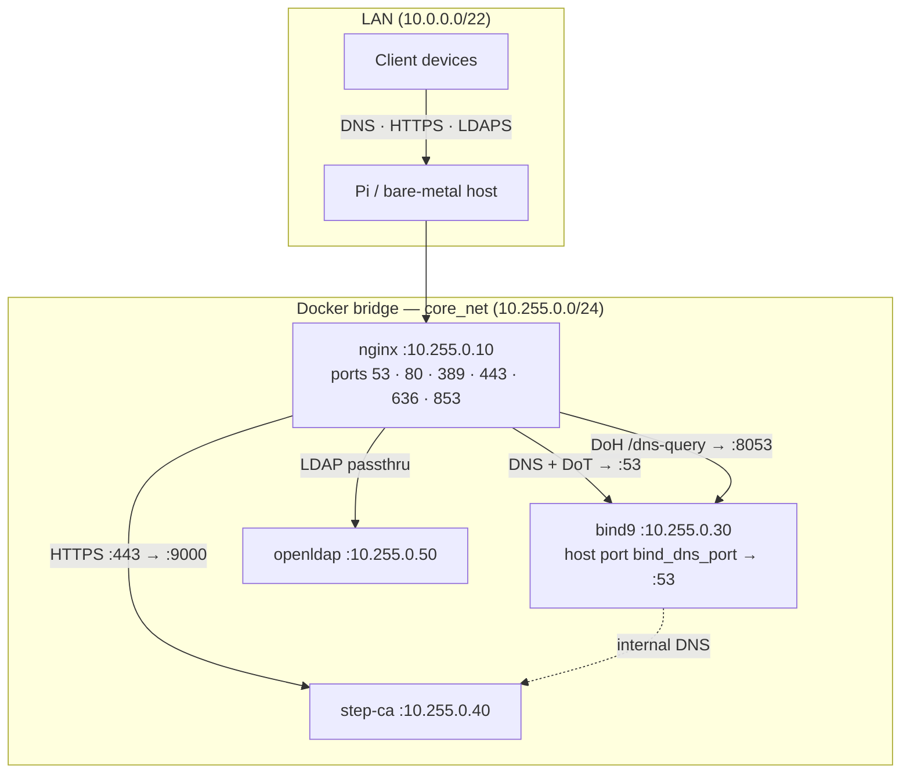
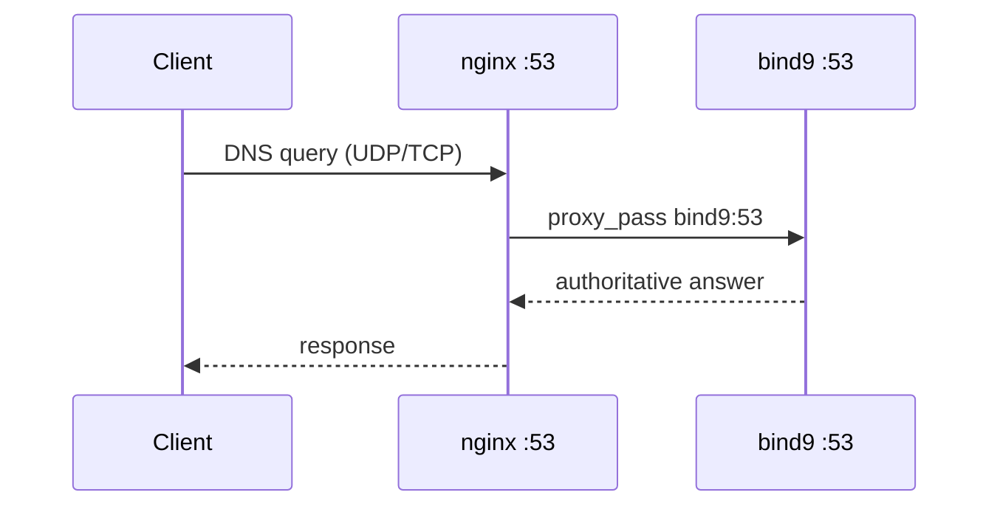
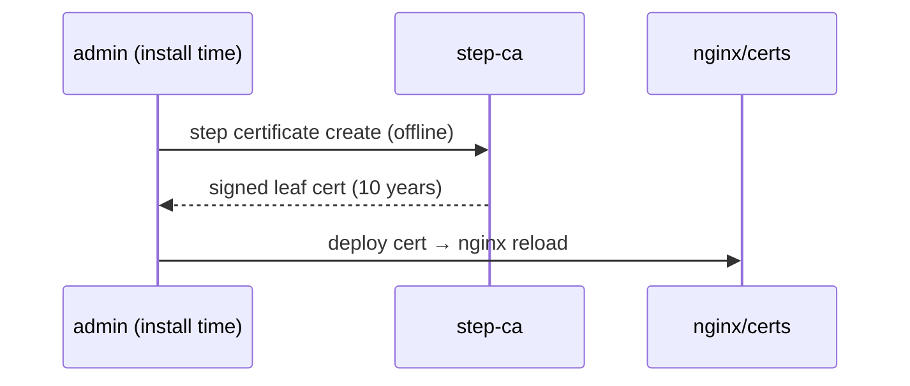

# core-template

> Ansible-driven home lab infrastructure: authoritative DNS, internal PKI, LDAP, and TLS — deployable locally or remotely, with offline support.

---

## Table of Contents

- [Synopsis](#synopsis)
- [Architecture](#architecture)
- [Installation](#installation)
  - [Prerequisites](#prerequisites)
  - [Offline Deployments](#offline-deployments)
  - [Configure vars](#configure-vars)
  - [Generate PKI (one-time, before install)](#generate-pki-one-time-before-install)
  - [Run the Installer](#run-the-installer)
- [Operations](#operations)
  - [Setup Modes](#setup-modes)
  - [Health Checks](#health-checks)
  - [Live Configuration Changes](#live-configuration-changes-modifysh)
    - [TSIG Key Management](#tsig-key-management)
    - [Certificate Minting](#certificate-minting)
    - [DNS Record Management](#dns-record-management)
  - [Ansible Tags Reference](#ansible-tags-reference)
  - [Service Ports](#service-ports)
- [Maintenance and Updates](#maintenance-and-updates)
  - [Updating Scripts](#updating-scripts)
  - [Rollback](#rollback)
  - [Uninstall](#uninstall)
  - [Version Tracking](#version-tracking)
- [Reference](#reference)
  - [PKI Chain](#pki-chain)
  - [DNS Architecture](#dns-architecture)
  - [Certificate Relay](#certificate-relay)
  - [Jinja2 Templates](#jinja2-templates)
  - [Customization Checklist](#customization-checklist)
- [Gaps and Next Tasks](#gaps-and-next-tasks)

---

## Synopsis

**core-template** is a template repository that provisions a self-contained home lab core stack via a single `setup.sh` invocation. It orchestrates 11 Ansible playbooks (sections 00–10) in sequence, standing up:

| Service | Container | Purpose |
|---------|-----------|---------|
| **BIND9** | `bind9` | Authoritative DNS + DNS-over-HTTPS + DNS-over-TLS |
| **nginx** | `nginx` | Reverse proxy — DNS/DoT/DoH/LDAP/HTTPS |
| **Step-CA** | `step-ca` | Internal PKI — root CA → intermediate → ACME |
| **OpenLDAP** | `openldap` | Directory services |

Everything is rendered from Jinja2 templates. User-facing settings live in `custom-vars.yaml` (repo root); infrastructure defaults live in `core/advanced-vars.yaml`. Secrets (CA password, TSIG keys) are pre-generated by `01-handle-vars.yml` into a git-ignored `core-secrets.yml` before rendering begins. Playbook `02-render-jinja.yml` merges all three sources through `core/jinja/vars.yaml.j2` and writes a resolved `vars.yaml` to `/tmp/core-template-render`. `04-target-file-structure.yml` copies it to the target alongside all other rendered outputs.

---

## Architecture



### Request flow — DNS



### Request flow — TLS certificate issuance



---

## Installation

### Prerequisites

Prerequisites are split into two categories:

**Local** — needed on the machine running `setup.sh`:

| Tool | Notes |
|------|-------|
| Ubuntu 24.04 LTS | The controller machine |
| Ansible 2.17+ | Must be pre-installed; use `offline.sh --install <controller-bundle>` for air-gapped hosts |
| Ansible collections | `community.docker`, `community.general`, `ansible.posix` — installed by `offline.sh --install` |
| `rsync`, `ssh-client` | Required for remote targets and `--export` |

**Remote** — needed on the target machine (installed automatically by the Ansible playbook):

| Component | Notes |
|-----------|-------|
| Ubuntu 24.04 LTS | The deployment target |
| Docker Engine 26+ | Installed by the playbook |
| `docker compose` v2 | Installed by the playbook |
| `python3-docker` | Required for Ansible Docker modules |
| System packages | `acl`, `openssl`, `ca-certificates`, `ufw`, etc. |
| Docker images | `nginx`, `ubuntu/bind9`, `smallstep/step-ca`, `core-alpine-tools` (pre-built — alpine + easy-rsa + openssl) |

For remote targets, SSH access and `sudo` rights are required. `setup.sh` handles SSH key distribution automatically on the first run.

---

### Offline Deployments

**Step 1** — on an internet-connected Ubuntu 24.04 machine, stage the bundles:

```bash
sudo ./offline.sh --stage [--output <dir>] [--compress | --package] [--no-images]
# Downloads APT packages, Docker images, and Ansible collections.
# Scans with ClamAV if installed (skipped with a warning if not).
# Produces two bundles in the output directory:
#   core-template-controller-<timestamp>/  — Ansible + collections (run on Ansible host)
#   core-template-target-<timestamp>/      — system/Docker packages + images (installed on target)
#
# --compress   produce .tar.gz archives instead of loose directories
# --package    produce .tar  archives instead of loose directories
# --no-images  skip pulling/saving Docker images (useful when images are already present)
```

**Step 2** — transfer both bundles to the air-gapped environment.

**Step 3** — install the controller bundle on the Ansible host (installs Ansible + collections):

```bash
sudo ./offline.sh --install ./core-template-controller-<timestamp>/
# Also accepts: .tar.gz, .tar, or legacy .zip archives
```

**Step 4** — run the installer, passing the target bundle for the remote host:

```bash
# Local target (Ansible host = deployment target)
sudo ./setup.sh --offline --prereqs-target ./core-template-target-<timestamp>/

# Remote target (Ansible host and target are separate machines)
sudo ./setup.sh --offline --prereqs-target ./core-template-target-<timestamp>/ \
                --target 192.168.1.5
```

`offline.sh --install` is the sole installer for controller-side prerequisites (Ansible, collections). `setup.sh` assumes they are already present and will error if `ansible-playbook` is not found. `--prereqs-target` passes the target bundle to Ansible so the playbook installs remote packages and loads Docker images without network access.

> **ClamAV:** if `clamav` is installed on the staging machine, `offline.sh --stage` will run `freshclam` and scan all downloaded files before packaging. The scan result (`CLEAN`, `THREATS FOUND`, or `SKIPPED`) is embedded in `scan-results.txt` inside each bundle. `setup.sh --prereqs` reads that result and warns (with a confirmation prompt) if the bundle was flagged.

---

### Configure vars

Variables are split across two files:

- **`custom-vars.yaml`** (repo root) — user-facing settings: domain, network (LAN CIDR, gateway, host IP), DNS records, PKI identity. Edit this file to customise your deployment.
- **`core/advanced-vars.yaml`** — infrastructure defaults and structural defaults: `deploy_base_dir`, Docker container IPs, image refs, port numbers, PKI lifetimes, `use_host_dns`, `system_timezone`, TSIG key definitions, LDAP groups and OUs. Override specific keys in `custom-vars.yaml` to change them; entries there take precedence.

`01-handle-vars.yml` generates secrets (CA password, one TSIG secret per key) and writes them to `core-secrets.yml` (git-ignored) on the first run; existing secrets are preserved on re-runs. `02-render-jinja.yml` then loads `custom-vars.yaml`, `advanced-vars.yaml`, and `core-secrets.yml`, renders `core/jinja/vars.yaml.j2`, and writes the fully-resolved result to `/tmp/core-template-render/vars.yaml`. All subsequent playbooks read from that rendered file.

Minimum required changes in `custom-vars.yaml`:

```yaml
# ── GLOBAL ──────────────────────────────────────────────────────────────────
domain: home                    # your internal TLD  (e.g. "lab", "internal")

# ── NETWORK ─────────────────────────────────────────────────────────────────
lan_cidr: 10.0.0.0/22           # your LAN subnet
lan_gateway: 10.0.0.1
host_ip: 10.0.3.53              # host machine IP on the LAN

# ── PKI ─────────────────────────────────────────────────────────────────────
acme_email: admin@email.internal

# ── DNS RECORDS ─────────────────────────────────────────────────────────────
# Zone key must be the static placeholder 'dynamic_zone_var'.
# Templates resolve it to the 'domain' value at render time.
dns:
  dynamic_zone_var:
    zone_authority: true        # emit NS A record pointing to host_ip
    tsig: acme_dns-01           # primary TSIG key for this zone
    A:
    - { name: core, ip: "{{ host_ip }}" }
    - { name: nas,  ip: 10.0.3.10 }
    CNAME:
    - { name: dns,  canonical: core }
    - { name: ldap, canonical: core }
    - { name: ca,   canonical: core }
```

Key tunables with their defaults:

| Variable | Default | Description |
|----------|---------|-------------|
| `bind_dns_port` | `5353` | Host port mapped to BIND9 container port 53 (`bind_dns_port:53`) — for direct host access and coexistence with other resolvers |
| `bind9_doh_port` | `8053` | BIND9 plain-HTTP DoH port (nginx terminates TLS) |
| `stepca_port` | `9000` | Step-CA HTTPS port |

> **`bind_dns_port`** is the host-side port Docker maps to BIND9's internal port 53 (e.g. `5353:53`). This keeps BIND9 off host port 53 so nginx can own it, while still letting host tools query directly: `dig @<host_ip> -p 5353`. nginx proxies public port 53 → `bind9:53` (container-to-container). nginx's port 53 (and all other LAN-facing ports) is bound to `host_ip` rather than `0.0.0.0` to avoid conflicts with `systemd-resolved`, which holds the loopback interface on Ubuntu.

---

### Generate PKI (optional, before install)

Certificates (such as the ones generated from our standalone [private-root-ca](https://github.com/private-root-ca) repository) are optional. 

If you choose to use an offline Root CA to sign your core TLS infrastructure, you should clone your CA repository (e.g., `private-root-ca`), generate the root and intermediate certificates offline on a secure machine, and never deploy the root key to the target.

Once your CA has generated the files, set them in `custom-vars.yaml`:

```yaml
root_cert_path: /path/to/my/offline-pki/output/root_ca.crt
intermediate_cert_path: /path/to/my/offline-pki/output/intermediate_ca.crt
```

Or supply the paths directly to `setup.sh` to bypass `custom-vars.yaml`:

```bash
sudo ./setup.sh \
    --root-cert /path/to/my/offline-pki/output/root_ca.crt \
    --intermediate-cert /path/to/my/offline-pki/output/intermediate_ca.crt
```

> Playbook `01-handle-vars.yml` checks for these paths and will leverage them for Step-CA if provided.

---

### Run the Installer

**Local install (most common):**

```bash
sudo ./setup.sh
```

**Local install without starting services:**

```bash
sudo ./setup.sh --no-start
```

**Remote install:**

```bash
sudo ./setup.sh --target 192.168.1.5
sudo ./setup.sh --target 192.168.1.5 --ssh-user myuser --no-start
```

On the first remote run, `setup.sh` will:
1. Generate `~/.ssh/id_ed25519` if no keypair exists
2. Trust the remote host key (`~/.ssh/known_hosts`)
3. Use `ssh-copy-id` to authorize the key (prompts for the remote password once)
4. Prompt for the remote sudo password before Ansible runs

After install, start services if you used `--no-start`:

```bash
docker compose -f /opt/core/docker-compose.yml up -d
```

---

## Operations

### Setup Modes

```bash
sudo ./setup.sh [mode] [flags]
```

| Mode | Description |
|------|-------------|
| *(default)* | Full install — bootstraps Ansible, runs the entire 11-section playbook (00–10) |
| `--update` | Safe update — re-renders scripts and static files only; never overwrites live service configs unless `--force` is added |
| `--rollback` | Restore the most recent pre-update archive snapshot (interactive) |
| `--uninstall` | Stop containers, remove service accounts and project directories (interactive); add `--force` to skip backups and confirmation prompt |
| `--custom --tags <tag>` | Run specific playbook sections by tag |

**Flags:**

| Flag | Description |
|------|-------------|
| `--target <ip>` | Deploy to a remote host |
| `--ssh-user <user>` | SSH username (defaults to invoking user) |
| `--root-cert <path>` | Path to root CA certificate — overrides `root_cert_path` in `custom-vars.yaml` |
| `--intermediate-cert <path>` | Path to intermediate CA certificate — overrides `intermediate_cert_path` |
| `--prereqs <path>` | Controller bundle zip or directory (from `offline.sh --stage`); installs Ansible + collections locally |
| `--prereqs-target <path>` | Target bundle zip or directory; passed to Ansible to install packages and load images on the target without internet |
| `--offline` | Skip external DNS resolution check (implied by `--prereqs` / `--prereqs-target`) |
| `--no-start` | Bring down docker containers after installation completes |
| `--export [path]` | Save built configs to `./builds/` (or specified path) |
| `--check` | Show what would change without applying |
| `--review` | Show full file diffs without applying (update mode) |
| `--apply` | Apply without interactive prompting |
| `--force` | Update mode: overwrite live configs in addition to scripts. Uninstall mode: skip backup offers and confirmation prompt. |
| `--version` / `-v` | Print version info |

**Common examples:**

```bash
sudo ./setup.sh --update                   # Preview script changes, prompt to apply
sudo ./setup.sh --update --review          # Show full diffs, don't apply
sudo ./setup.sh --update --apply           # Apply silently (CI-friendly)
sudo ./setup.sh --update --force --apply   # Overwrite everything, including configs
sudo ./setup.sh --export                   # Install + save build archive to ./builds/
sudo ./setup.sh --custom --tags pki        # Re-run PKI section only
sudo ./setup.sh --custom --tags service-certs  # Re-issue offline Step-CA certs for core services
```

---

### Live Configuration Changes (`manage.sh`)

Use `core/manage.sh` for post-install changes to DNS records, TSIG keys, and certificates — no full redeploy needed. Run it **on the target machine** (requires root / sudo); Ansible is not required and it relies only on the deployed `vars.yaml`.

```bash
sudo bash core/manage.sh [mode] [flags]
```

#### TSIG Key Management

TSIG keys grant named DNS update rights to external services (NAS, reverse proxies, other hosts) for specific hostnames only.

```bash
# Interactive — prompts for key name, domain, and hostnames to allow
sudo bash core/manage.sh --tsig-keys

# List all active keys and their per-record grants
sudo bash core/manage.sh --list-tsig

# Remove a key by name
sudo bash core/manage.sh --remove-tsig acme_nas-proxy
```

All TSIG keys are managed in the `tsig_keys` list in `vars.yaml`. Each key carries a `record_types` list that drives its `update-policy` grant in BIND9:

- `primary: true` + `record_types` → `grant key subdomain _acme-challenge <types>` (ACME DNS-01 scope)
- no `primary` + `record_types` → `grant key zonesub <types>` (zone-wide update rights for those types)

```yaml
tsig_keys:
- name: acme_dns-01       # primary ACME key — managed by installer
  algorithm: hmac-sha256
  domain: '{{ domain }}'
  primary: true
  record_types: [TXT]     # may update _acme-challenge TXT records
- name: acme_nas-proxy    # extra key — applied by manage.sh
  algorithm: hmac-sha256
  domain: '{{ domain }}'
  record_types: [TXT, A]  # zone-wide TXT and A update rights
```

All TSIG key names are also collected into a `tsig-updaters` ACL in `named.conf.acl` so they can be referenced in other BIND9 directives. Each key generates:
- An entry in `named.conf.keys` with a random 256-bit secret
- `update-policy` grant(s) in `named.conf.zones` based on `record_types`
- A `rfc2136.ini` credentials file for the consuming service

#### Certificate Minting

Mint TLS certificates for services outside this stack (NAS apps, VMs, etc.).

```bash
# Interactive — prompts for CN, SANs, days, output dir, key type/size;
# shows a full review screen before writing anything
sudo bash core/manage.sh --mint-certs

# Non-interactive — mints all entries in extra_certs from vars.yaml
sudo bash core/manage.sh --mint-certs --apply

# Override key type / size (default: RSA 4096)
sudo bash core/manage.sh --mint-certs --kty EC --size 384

# Issue a subordinate CA certificate (pathLen=0 — cannot sign further CAs)
sudo bash core/manage.sh --mint-certs --intermediate-ca

# Subordinate CA that can sign one further CA level (pathLen=1)
sudo bash core/manage.sh --mint-certs --intermediate-ca 1
```

`vars.yaml` structure for extra certificates:

```yaml
extra_certs:
- cn: nas-apps.internal
  sans: [jellyfin.internal, sonarr.internal]
  days: 365
  kty: RSA           # RSA | EC | OKP  (default: RSA)
  size: 4096         # RSA: 2048/3072/4096  EC: 256/384  (default: 4096)
  out_dir: /srv/certs
```

**Offline mode:** signed directly by Step-CA using the internal `leaf.tpl` x509 template — no ACME required.

**ACME mode:** issued via Step-CA's ACME provisioner with DNS-01 validation against BIND9 using the primary TSIG key. All core service certs (`dns.internal`, `ldap.internal`, `ca.internal`) are offline Step-CA certs issued at install time.

#### DNS Record Management

Add or remove records in BIND9 zones without a full redeploy.

```bash
# Interactive add — prompts for zone, type, and values
sudo bash core/manage.sh --dns-record

# Non-interactive — re-renders all zones from the dns: block in vars.yaml
sudo bash core/manage.sh --dns-record --apply

# Interactive remove — lists live records; pick by number to remove
sudo bash core/manage.sh --remove-dns-record
```

Supported record types: `A`, `AAAA`, `CNAME`, `MX`, `TXT`, `SRV`.

Both operations edit `vars.yaml`, then re-render forward and reverse zone files directly from `vars.yaml` using an inline Python renderer (PyYAML only — no Jinja2 engine or Ansible required). Rendered files are written to `/opt/bind9/data/` with bind ownership (uid/gid 53, mode 0640) and BIND9 is reloaded via `rndc reload`. Zone serials are incremented automatically (YYYYMMDDNN). When adding an `A` record the interactive prompt shows the PTR entry that will be auto-generated in the corresponding reverse zone.

`dns:` zone key uses the actual domain string (the `dynamic_zone_var` placeholder is already resolved to `domain` at install time):

```yaml
dns:
  yourdomain.internal:
    zone_authority: true    # emit NS A record pointing to host_ip
    tsig: acme_dns-01
    A:
    - { name: myserver, ip: 10.0.3.99 }
    CNAME:
    - { name: app, canonical: myserver }
    TXT:
    - { name: myserver, text: "v=spf1 -all" }
```

**Reverse zones are auto-generated.** Every unique /24 subnet found in `A` records gets a `<octet3>.<octet2>.<octet1>.in-addr.arpa` zone file rendered from `reverse-zone.j2` and a corresponding zone entry in `named.conf.zones`. PTR records are derived from the forward A records — no separate configuration needed.

---

### Ansible Tags Reference

The full playbook (`core/playbooks/core-config.yml`) is an `import_playbook` entry point composed of individual playbooks in `core/playbooks/`. Each section can be run directly for targeted operations:

```bash
# Via setup.sh (recommended — handles SSH key setup and sudo)
sudo ./setup.sh --custom --tags <tag>

# Or directly with ansible-playbook
ansible-playbook core/playbooks/04-target-file-structure.yml -e target_host=core --tags dns-record
ansible-playbook core/playbooks/08-mint-service-certs.yml    -e target_host=core
ansible-playbook core/playbooks/09-deploy-checks.yml         -e target_host=core
```

| Tag | Section | Playbook | What it does |
|-----|---------|----------|-------------|
| `prereqs`,`validation` | 00 | `00-system-check.yml` | Assert Ubuntu; install packages + Docker Engine; confirm BuildKit available |
| *(always)* `handle-vars` | 01 | `01-handle-vars.yml` | Generate CA password + TSIG secrets into `core-secrets.yml` (idempotent) |
| *(always)* `render-jinja` | 02 | `02-render-jinja.yml` | Merge all vars + secrets; render every template to `/tmp/core-template-render` |
| `users` | 03 | `03-target-service-accounts.yml` | Create service accounts (nginx, bind, step, ldap) |
| `file-structure`, `update`, `dns-record`, `bind9`, `stepca`, `nginx`, `openldap` | 04 | `04-target-file-structure.yml` | Create directory tree; deploy configs, stepca dirs, bind9 runtime dirs; `rndc reload` on `dns-record` |
| `network`, `firewall` | 05 | `05-target-network.yml` | Harden systemd-resolved; configure UFW (LAN allow-list) |
| `pki`, `stepca` | 06 | `06-configure-stepca.yml` | Sign intermediate CA CSR (if deployed); initialize and configure step-ca |
| `pki`, `bootstrap` | 07 | `07-bootstrap-containers.yml` | Bootstrap bind9+step-ca containers safely |
| `pki`, `mint-certs` | 08 | `08-mint-service-certs.yml` | Mint BIND9 TLS, service certs, and `extra_certs` |
| `verify`, `deploy-checks` | 09 | `09-deploy-checks.yml` | Start full stack; dig DNS; check nginx/HTTPS; export 30s logs; drop stack if `no_start` |
| `cleanup-temp`, `teardown` | 10 | `10-clean-up.yml` | Teardown stack if `no_start`; remove `/tmp/core-template-render` |

---

### Service Ports

| Port | Proto | Handler | Backend |
|------|-------|---------|---------|
| 53 | TCP + UDP | nginx | `bind9:53` (container-to-container) |
| 80 | TCP | nginx | health check · ACME passthrough · HTTPS redirect |
| 389 | TCP | nginx | `openldap:389` (plain LDAP passthrough) |
| 443 | TCP | nginx | `step-ca:9000` · `bind9:8053` (`/dns-query`) |
| 636 | TCP | nginx | `openldap:389` (LDAPS — nginx terminates TLS) |
| 853 | TCP | nginx | `bind9:53` (DoT — nginx terminates TLS) |
| `bind_dns_port` | TCP + UDP | bind9 | host-facing (mapped `bind_dns_port:53`); default `5353` |
| `bind9_doh_port` | TCP | bind9 | plain-HTTP DoH; default `8053` |
| `stepca_port` | TCP | step-ca | internal HTTPS; default `9000` |

> `bind_dns_port` (default `5353`) is the Docker host port mapped to BIND9's internal port 53 (`bind_dns_port:53`). BIND9 only listens on port 53 inside the container; Docker forwards host traffic on `bind_dns_port` to it. nginx connects to `bind9:53` directly (container-to-container). Change `bind_dns_port` in `vars.yaml` and re-run `--custom --tags bind9` if another service already uses `5353` on the host.

---

## Maintenance and Updates

### Updating Scripts

`--update` mode re-renders scripts and static files from the current repo without touching live service configs:

```bash
sudo ./setup.sh --update              # Summary of what changed; prompt to apply
sudo ./setup.sh --update --review     # Full file diffs before applying
sudo ./setup.sh --update --apply      # Apply silently (CI-friendly)
```

Files updated: `setup.sh`, `manage.sh`, `cert-relay-host.sh`, `cert-update.sh`, PKI info page.

To also update service configs (nginx, BIND9, docker-compose, etc.), add `--force`:

```bash
sudo ./setup.sh --update --force --apply   # WARNING: overwrites live configs
```

A snapshot of `/opt/core/` is automatically archived before every update.

### In-Place Upgrades (`upgrade.sh`)

Use `upgrade.sh` to seamlessly upgrade an existing deployment to inherit new structural features and updated Docker images while preserving your live variables and configuration state.

```bash
sudo ./upgrade.sh                # Interactive full upgrade — adds all new modular features by default
sudo ./upgrade.sh --only-existing # Upgrades existing containers/tooling but skips new features (like OpenLDAP)
sudo ./upgrade.sh --offline      # Fails proactively if new images are not locally cached
sudo ./upgrade.sh --apply        # Non-interactive execution
```

It extracts your active `vars.yaml` from the live target (`/opt/core/vars.yaml`), archives a backup snapshot to `/opt/core/archive/`, and seamlessly merges your localized state onto the newest template variable definitions. It then coordinates an image pull, drops the container stack cleanly if structural changes arise, redeploys the new file hierarchy, and brings the stack back online.

---

### Rollback

Restore from the most recent pre-update snapshot:

```bash
sudo ./setup.sh --rollback
```

Interactive — shows the available snapshot and asks for confirmation before restoring.

---

### Uninstall

```bash
sudo ./setup.sh --uninstall
```

Stops and removes all containers, removes service accounts, and deletes `/opt/{core,nginx,bind9,stepca,openldap}/`. Interactive — offers to save a backup snapshot and confirms before proceeding.

Add `--force` to skip all prompts and wipe immediately with no backup:

```bash
sudo ./setup.sh --uninstall --force
```

---

### Version Tracking

Every rendered file includes a version stamp in its header so you can trace any deployed config back to its source commit.

**Export a build archive:**

```bash
sudo ./setup.sh --export ./builds/
```

Captures all rendered configs in a git-tracked directory. Each export is one commit — `git diff` between two exports shows exactly what changed in the deployed environment.

---

## Reference

### PKI Chain

```
Root CA  (offline — manually generated, key never deployed to target)
    ├── Standalone leaf certs  (signed offline)
    └── Step-CA Intermediate CA  (signed offline)
            ├── BIND9 static TLS cert   (offline via step-ca, ~15 years)
            ├── Offline leaf certs      (issued at install time via step-ca)
            │       ├── dns.<domain>    → nginx DoT / DoH
            │       ├── ldap.<domain>   → nginx LDAPS
            │       └── ca.<domain>     → nginx → Step-CA
            └── extra_certs  (offline or ACME, per-entry config)
```

The root CA key is generated on the operator's machine before install and is **never deployed to the target**. After signing the intermediate CA, it can be stored offline or destroyed. The installer deploys only `root_ca.crt` (public), `intermediate_ca.crt` (public), and `intermediate_ca.key` (secret — step-ca uses this at runtime). Step-CA serves as the ACME endpoint and signs all runtime leaf certs via its intermediate CA. DNS-01 challenges can be fulfilled via the primary TSIG key (`acme_dns-01`).

The intermediate CA key is derived from the same directory as `intermediate_cert_path` (`intermediate_ca.key`). This can be overridden at install time with `-e intermediate_key_path=<path>`.

Internal CA files are distributed to services as `root_ca.crt` volume mounts. The PKI info page is available at two URLs:

- `https://ca.<domain>/pki/` — hosted on the Step-CA vhost
- `https://certificates.<domain>/` — dedicated vhost with clean download URLs (`/root_ca.crt`, `/intermediate_ca.crt`)

---

### DNS Architecture

BIND9 runs as an **authoritative-only** server (recursion disabled). It serves:
- Internal forward zones defined in the `dns:` block of `custom-vars.yaml` (`dynamic_zone_var` key resolved to `domain` at render time)
- Each zone with `zone_authority: true` gets an NS A record pointing to `host_ip`
- Reverse zones (PTR) auto-generated from A records — one `/24` `in-addr.arpa` zone per unique subnet; `reverse_zone_names` computed in `vars.yaml.j2`
- ACME challenge and zone records updateable per `tsig_keys[].record_types` (primary keys → `subdomain _acme-challenge`; others → `zonesub`)
- Any additional keys managed by `manage.sh --tsig-keys`

nginx fronts BIND9 on all public DNS ports:

```
:53  TCP/UDP  → bind9:53   plain DNS
:853 TCP      → bind9:53   DNS-over-TLS  (nginx terminates TLS)
:443 /dns-query → bind9:8053          DNS-over-HTTPS (nginx terminates TLS)
```

`bind_dns_port` (default `5353`) is the Docker host port mapped to BIND9's internal port 53. BIND9 only listens on port 53 inside the container; Docker publishes it on `bind_dns_port` on the host. This keeps host port 53 free for nginx, while allowing direct host queries via `dig @localhost -p 5353`. Point a forwarding resolver (Pi-hole, Unbound, etc.) at `127.0.0.1:<bind_dns_port>` for local zone resolution.

---

### Certificate Relay

Core service certificates (`dns.<domain>`, `ldap.<domain>`, `ca.<domain>`, `certificates.<domain>`) are offline Step-CA leaf certs with a 10-year lifetime, issued at install time via `step certificate create`. There is no certbot container or cert-relay service. nginx reads the issued certs directly from the volume paths set during install.

---

### Jinja2 Templates

All `.j2` files in this repo are rendered by the Ansible playbook into `/opt/<service>/`. The `.j2` source files are removed from `/opt` after rendering — only rendered outputs remain on the host.

| Template | Rendered to |
|----------|------------|
| `core/jinja/vars.yaml.j2` | `/tmp/core-template-render/vars.yaml` (resolved vars — merged at run time) |
| `core/jinja/docker-compose.yml.j2` | `/opt/core/docker-compose.yml` |
| `core/jinja/nginx/nginx.conf.j2` | `/opt/nginx/nginx.conf` |
| `core/jinja/nginx/pki/index.html.j2` | `/opt/nginx/pki/index.html` |
| `core/jinja/bind9/config/named.conf*.j2` | `/opt/bind9/config/named.conf*` |
| `core/jinja/bind9/data/zone.j2` | `/opt/bind9/data/db.<zone>` (forward zones) |
| `core/jinja/bind9/data/reverse-zone.j2` | `/opt/bind9/data/db.<octet3>.<octet2>.<octet1>.in-addr.arpa` (PTR — auto-generated) |
| `core/jinja/openldap/*.ldif.j2` | `/opt/openldap/*.ldif` |
| `core/jinja/stepca/leaf.tpl.j2` | `/opt/stepca/data/templates/certs/leaf.tpl` |
| `core/jinja/stepca/subca.tpl.j2` | `/opt/stepca/data/templates/certs/subca.tpl` |

---

### Customization Checklist

Before your first install, review and set these in `custom-vars.yaml` (user settings). Infrastructure defaults (`deploy_base_dir`, image tags, port numbers, PKI lifetimes) are in `core/advanced-vars.yaml`.

- [ ] `domain` — your internal TLD
- [ ] `system_timezone` — IANA timezone string
- [ ] `lan_cidr` / `lan_gateway` — your LAN network
- [ ] `host_ip` — host machine's LAN IP
- [ ] `dns_server` — upstream DNS used during bootstrap (only used when `use_host_dns: false` in `core/advanced-vars.yaml`; defaults to using the host's existing resolver)
- [ ] `acme_email` — email for ACME registration
- [ ] `ca_name`, `cert_country`, `cert_org` — CA subject fields
- [ ] `root_cert_path` / `intermediate_cert_path` — configure these to point to your PKI generation paths if utilizing Step-CA/TLS.
- [ ] `dns:` block — A and CNAME records for your hosts
- [ ] `ldap_groups` / `ldap_organizational_units` — directory structure
- [ ] `tsig_keys` — add non-primary entries for external services that need DNS update rights (optional)
- [ ] `bind_dns_port` — change from `5353` if that port conflicts with an existing service
- [ ] `image_nginx` / `image_bind9` / `image_stepca` / `image_alpine_tools` — override to pin images to specific digests or a local registry (optional; defaults to `:latest` tags)

---

## Gaps and Next Tasks

The following gaps were identified while writing this document:

**Missing features:**
- No automated health check for DoH (`/dns-query`) or DoT (`:853`) endpoints — these are core delivery paths.
- No LDAP user/group provisioning tooling — `vars.yaml` defines the OU structure but adding actual users requires manual `ldapadd` after install.

**Hardening gaps:**
- Docker images are still referenced by `:latest` tag by default. All image references are now centralized in `vars.yaml` (`image_nginx`, `image_bind9`, `image_stepca`, `image_alpine_tools`) making digest pinning straightforward — but the defaults remain mutable `:latest` tags.

**Documentation gaps:**
- `manage.sh --mint-certs` ACME mode references a Portainer webhook URL but its expected format and behavior are not documented.
- IPv6 is not addressed in `vars.yaml` or `core/jinja/docker-compose.yml.j2`, despite BIND9 listening on `listen-on-v6 { any; }`.
- No monitoring or alerting integration — cert expiry requires manual verification.

<!-- readme-version: cdab97e -->
