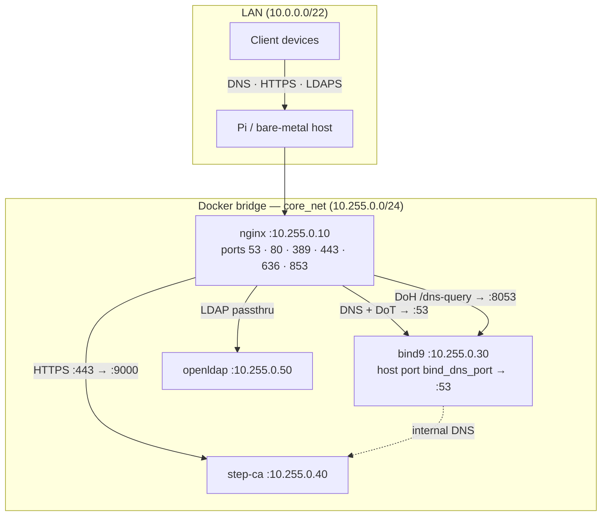
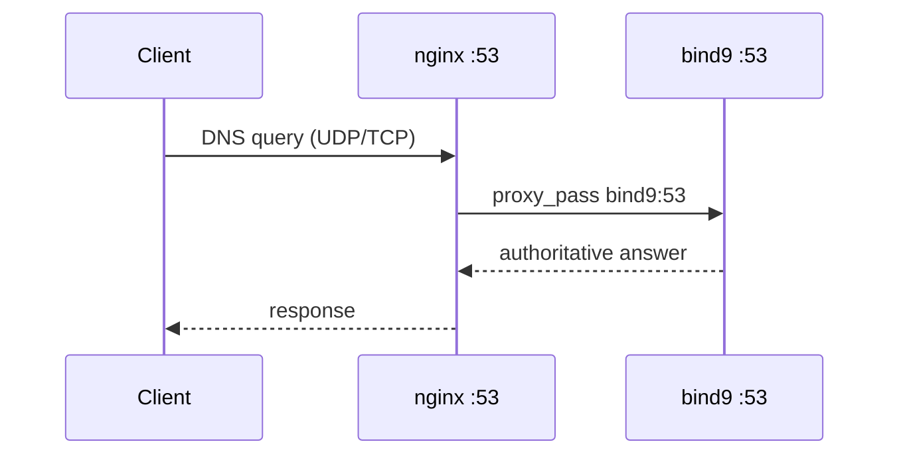
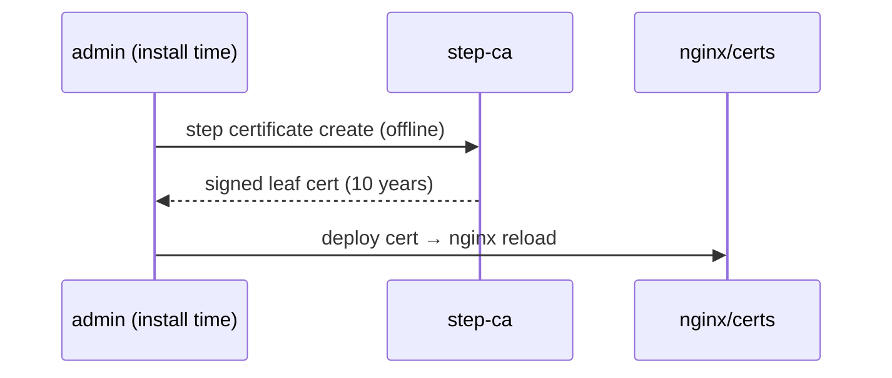

# Architecture and Reference

This document provides an in-depth breakdown of the `core-template` infrastructure, covering the request flows, the underlying directory structures (both source and target), and technical references for PKI, DNS, and Jinja2 rendering.

### Table of Contents
- [Repository Structure](#repository-structure)
- [Target Deployment Structure](#target-deployment-structure)
- [System Topology](#system-topology)
- [DNS Architecture](#dns-architecture)
- [Request flow — DNS](#request-flow--dns)
- [PKI Chain](#pki-chain)
- [Certificate Relay](#certificate-relay)
- [Request flow — TLS certificate issuance](#request-flow--tls-certificate-issuance)
- [Jinja2 Templates](#jinja2-templates)

---

## Repository Structure

```text
.
├── core
│   ├── jinja
│   │   ├── bind9
│   │   ├── docker-compose.yml.j2
│   │   ├── nginx
│   │   ├── openldap
│   │   ├── stepca
│   │   └── vars.yaml.j2
│   ├── lib
│   │   ├── archive.sh
│   │   ├── certs.sh
│   │   ├── dns.sh
│   │   ├── output.sh
│   │   ├── package.sh
│   │   ├── prereqs.sh
│   │   ├── services.sh
│   │   ├── ssh.sh
│   │   ├── tsig.sh
│   │   ├── upgrade.sh
│   │   └── vars.sh
│   ├── manage.sh
│   └── playbooks
│       ├── 00-system-check.yml
│       ├── 01-handle-vars.yml
│       ├── 02-render-jinja.yml
│       ├── 03-target-service-accounts.yml
│       ├── 04-target-file-structure.yml
│       ├── 05-target-network.yml
│       ├── 06-configure-stepca.yml
│       ├── 07-bootstrap-containers.yml
│       ├── 07-validate-ldap.yml
│       ├── 08-mint-service-certs.yml
│       ├── 09-deploy-checks.yml
│       ├── 10-clean-up.yml
│       ├── ansible.cfg
│       ├── core-config.yml
│       ├── upgrade
│       └── upgrade.yml
├── custom-vars.yaml
├── docs
│   ├── ansible-doc.md
│   ├── architecture.md
│   ├── install.md
│   ├── lib-doc.md
│   ├── operations.md
│   ├── subordinate.md
│   └── updates.md
├── offline.sh
├── setup.sh
└── tests
```

---

## Target Deployment Structure

```text
/opt/
├── bind9               # Managed: configs and zones updated by installer
│   ├── cache           # Persistent: BIND9 cache data
│   ├── config          # Managed: named.conf*, rndc.key overwritten on upgrade
│   ├── data            # Managed: db.* (zones) overwritten on upgrade (except dynamic journals)
│   └── log             # Persistent: BIND9 log directory
├── core                # Managed/Persistent mix
│   ├── archive         # Persistent: Automated snapshots are stored here
│   ├── core-secrets.yml # Persistent: Safely preserved secrets for TLS and DNS
│   ├── docker-compose.yml # Managed: Re-rendered and overwritten on upgrade
│   ├── lib/            # Managed: Utility library mapped alongside manage.sh
│   ├── manage.sh       # Managed: The standalone live configuration tool
│   ├── src/            # Managed: A full mirror of the deployment repository (playbooks, scripts, templates)
│   └── vars.yaml       # User-managed: Safely merged and preserved on upgrade
├── nginx               # Managed: config updated by installer
│   ├── nginx.conf      # Managed: Overwritten on upgrade
│   └── pki             # Managed: index.html
├── openldap            # Managed/Persistent mix
│   ├── config          # Persistent: slapd.d config database
│   ├── data            # Persistent: main LDAP database
│   └── ...ldif         # Managed: Schema templates re-rendered on upgrade
└── stepca              # Persistent: Internally manages certs, keys, and DB
    └── data            # Persistent: PKI database, certs, and configurations
        ├── certs       # Persistent
        ├── config      # Persistent
        ├── secrets     # Persistent
        └── templates   # Managed: leaf.tpl and subca.tpl overwritten on upgrade
```

---

## System Topology



---

## DNS Architecture

BIND9 runs as an **authoritative-only** server (recursion disabled). It serves:
- Internal forward zones defined in the `dns:` block of `custom-vars.yaml` (`dynamic_zone_var` key resolved to `domain` at render time)
- Each zone with `zone_authority: true` gets an NS A record pointing to `host_ip`
- Reverse zones (PTR) auto-generated from A records — one `/24` `in-addr.arpa` zone per unique subnet; `reverse_zone_names` computed in `vars.yaml.j2`
- ACME challenge and zone records updateable per `tsig_keys[].record_types` (primary keys → `subdomain _acme-challenge`; others → `zonesub`)
- Any additional keys managed by `manage.sh --tsig-keys`

nginx fronts BIND9 on all public DNS ports:

```
:53  TCP/UDP  → bind9:53   plain DNS
:853 TCP      → bind9:53   DNS-over-TLS  (nginx terminates TLS)
:443 /dns-query → bind9:8053          DNS-over-HTTPS (nginx terminates TLS)
```

`bind_dns_port` (default `5353`) is the Docker host port mapped to BIND9's internal port 53. BIND9 only listens on port 53 inside the container; Docker publishes it on `bind_dns_port` on the host. This keeps host port 53 free for nginx, while allowing direct host queries via `dig @localhost -p 5353`. Point a forwarding resolver (Pi-hole, Unbound, etc.) at `127.0.0.1:<bind_dns_port>` for local zone resolution.

---

## Request flow — DNS



---

## PKI Chain

```
Root CA  (offline — manually generated, key never deployed to target)
    ├── Standalone leaf certs  (signed offline)
    └── Step-CA Intermediate CA  (signed offline)
            ├── BIND9 static TLS cert   (offline via step-ca, ~15 years)
            ├── Offline leaf certs      (issued at install time via step-ca)
            │       ├── dns.<domain>    → nginx DoT / DoH
            │       ├── ldap.<domain>   → nginx LDAPS
            │       └── ca.<domain>     → nginx → Step-CA
            └── extra_certs  (offline or ACME, per-entry config)
```

The root CA key is generated on the operator's machine before install and is **never deployed to the target**. After signing the intermediate CA, it can be stored offline or destroyed. The installer deploys only `root_ca.crt` (public), `intermediate_ca.crt` (public), and `intermediate_ca.key` (secret — step-ca uses this at runtime). Step-CA serves as the ACME endpoint and signs all runtime leaf certs via its intermediate CA. DNS-01 challenges can be fulfilled via the primary TSIG key (`acme_dns-01`).

The intermediate CA key is automatically derived from the `ica_crt_path` by default exchanging the `.crt` extension for `.key`. This can be overridden explicitly in `custom-vars.yaml` or with `--ica-key <path>`.

Internal CA files are distributed to services as `root_ca.crt` volume mounts. The PKI info page is available at two URLs:

- `https://ca.<domain>/pki/` — hosted on the Step-CA vhost
- `https://certificates.<domain>/` — dedicated vhost with clean download URLs (`/root_ca.crt`, `/intermediate_ca.crt`)

---

## Certificate Relay

Core service certificates (`dns.<domain>`, `ldap.<domain>`, `ca.<domain>`, `certificates.<domain>`) are offline Step-CA leaf certs with a 10-year lifetime, issued at install time via `step certificate create`. There is no certbot container or cert-relay service. nginx reads the issued certs directly from the volume paths set during install.

---

## Request flow — TLS certificate issuance



---

## Jinja2 Templates

All `.j2` files in this repo are rendered by the Ansible playbook into `/opt/<service>/`. The `.j2` source files are removed from `/opt` after rendering — only rendered outputs remain on the host.

| Template | Rendered to |
|----------|------------|
| `core/jinja/vars.yaml.j2` | `/tmp/core-template-render/vars.yaml` (resolved vars — merged at run time) |
| `core/jinja/docker-compose.yml.j2` | `/opt/core/docker-compose.yml` |
| `core/jinja/nginx/nginx.conf.j2` | `/opt/nginx/nginx.conf` |
| `core/jinja/nginx/pki/index.html.j2` | `/opt/nginx/pki/index.html` |
| `core/jinja/bind9/config/named.conf*.j2` | `/opt/bind9/config/named.conf*` |
| `core/jinja/bind9/data/zone.j2` | `/opt/bind9/data/db.<zone>` (forward zones) |
| `core/jinja/bind9/data/reverse-zone.j2` | `/opt/bind9/data/db.<octet3>.<octet2>.<octet1>.in-addr.arpa` (PTR — auto-generated) |
| `core/jinja/openldap/*.ldif.j2` | `/opt/openldap/*.ldif` |
| `core/jinja/stepca/leaf.tpl.j2` | `/opt/stepca/data/templates/certs/leaf.tpl` |
| `core/jinja/stepca/subca.tpl.j2` | `/opt/stepca/data/templates/certs/subca.tpl` |
