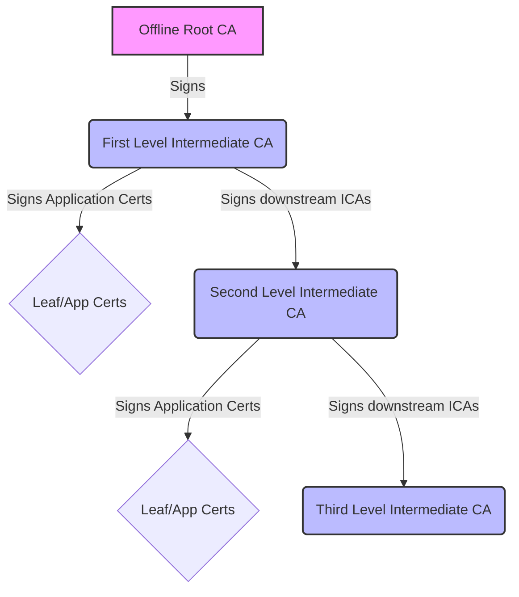
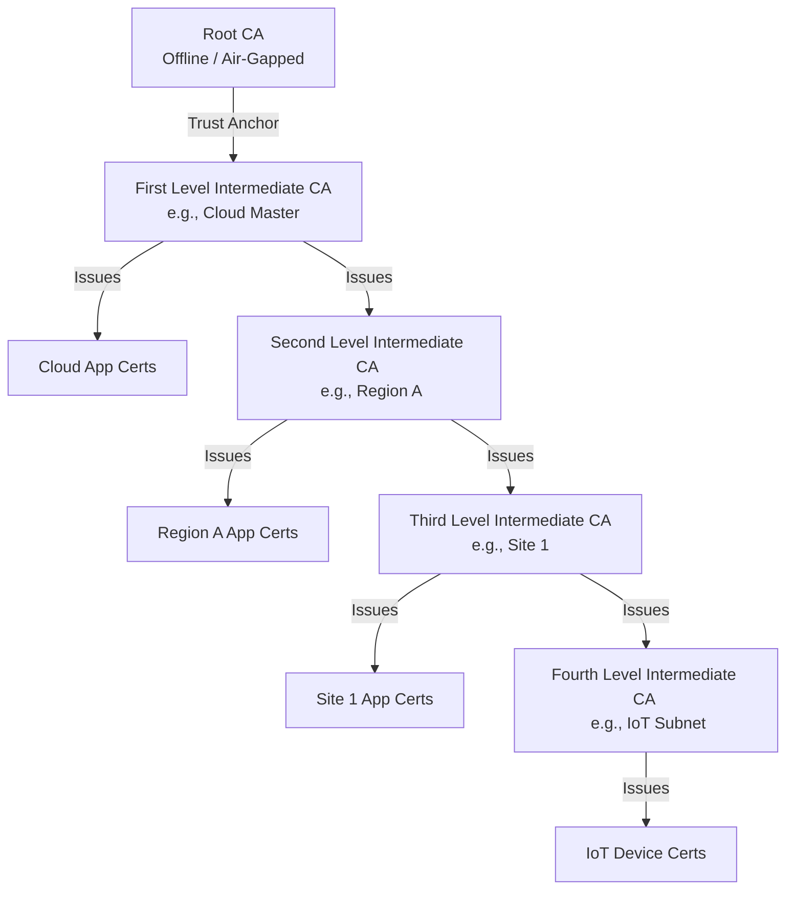

# Subordinate CA Infrastructure (Nested Layouts)

The `core-template` infrastructure natively supports multi-tier, nested PKI deployments. This allows you to build a comprehensive hierarchy where a "First Level Intermediate CA" can issue both local application certificates AND sign further Subordinate ICAs for segmented environments (Second Level Intermediate CAs, Third Level, etc.).

### Are Subordinate CAs minted from the Root or the ICA?
When you use `core-template`'s `core-mgr` to mint a subordinate CA, it is **minted and signed by the Intermediate CA**, not the Root CA. The `step-ca` daemon running on your host operates exclusively using the Intermediate CA's private key. The Root CA remains isolated and is not used for day-to-day operations.



Because all intermediate CAs in this chain are ultimately derived from the same Root CA, any device that trusts the Root CA will automatically trust application certificates issued by *any* ICA in the network, establishing seamless mutual trust across all levels.

### Table of Contents
- [Intended Architectural Workflow](#intended-architectural-workflow)
- [Example Scenario (Deep Nesting)](#example-scenario-deep-nesting)
- [Step 1: Mint the Subordinate CA on the First Level Host](#step-1-mint-the-subordinate-ca-on-the-first-level-host)
- [Hardware Keys: Signing a CSR](#hardware-keys-signing-a-csr)
- [Step 2: Retrieve the Root CA](#step-2-retrieve-the-root-ca)
- [Step 3: Transfer Files to the Subordinate Host](#step-3-transfer-files-to-the-subordinate-host)
- [Step 4: Configure the Subordinate Deployment](#step-4-configure-the-subordinate-deployment)

## Intended Architectural Workflow

A highly secure, best-practice deployment looks like this:
1. **Offline Root CA**: A highly secured, offline machine generates the Root CA and signs the certificate for your **First Level Intermediate CA**. The Root CA then goes offline to protect its private key.
2. **First Level Intermediate CA**: Installed via BYOC (Bring Your Own Certs) on your master infrastructure. This ICA performs two roles:
   - Signs application/leaf certificates for its local network.
   - Generates and signs certificates for downstream **Second Level Intermediate CAs**.
3. **Second Level Intermediate CAs**: Segmented infrastructure deployments that operate independently to sign application/leaf certificates for their respective networks, and potentially sign **Third Level Intermediate CAs**.

## Example Scenario (Deep Nesting)

You can chain ICAs infinitely. Here is an example of a 4-level deep architecture, fully supported by this trust model.


As long as the client devices have the **Root CA** installed, they will implicitly trust `App1`, `App2`, `App3`, and `App4` seamlessly.

## Step 1: Mint the Subordinate CA on the First Level Host

Log in to the host machine running your First Level infrastructure. Use the built-in management script to mint a new intermediate CA certificate.

```bash
sudo core-mgr --mint-certs --intermediate-ca
```

**Interactive Prompts:**
1. **Common Name**: Provide a descriptive name, e.g., `Region A Second Level ICA`.
2. **Path Length**: You will be asked for a `pathLen`. This specifies how many further levels of ICAs this new CA is allowed to issue. For a Second Level ICA that needs to issue Third Level ICAs, specify `1` or greater. If it should only issue leaf certificates, use `0`.
3. **Output directory**: Enter a convenient output directory (e.g., `/tmp/sub-certs`).

This will generate two files in the output directory:
- `Region_A_Second_Level_ICA.crt` (The intermediate CA certificate)
- `Region_A_Second_Level_ICA.key` (The private key for the intermediate CA)

## Hardware Keys: Signing a CSR

If you are using a **Hardware Security Module (HSM)** or a **YubiKey** to store the private key for your Second Level Intermediate CA, you will generate a Certificate Signing Request (CSR) locally on the hardware instead of letting `core-mgr` generate the key for you.

Once you have your CSR file (e.g., `hardware-key.csr`), you can use the First Level infrastructure's `step-ca` backend to sign it.

1. Transfer your `hardware-key.csr` to the First Level host.
2. Copy it into the step-ca volume:
   ```bash
   sudo cp hardware-key.csr /opt/stepca/data/artifacts/
   ```
3. Use the `step certificate sign` command directly inside the container to sign the CSR using the First Level ICA's private key:
   ```bash
   sudo docker exec -it step-ca step certificate sign \
       /home/step/artifacts/hardware-key.csr \
       /home/step/certs/intermediate_ca.crt \
       /home/step/secrets/intermediate_ca_key \
       --profile intermediate-ca \
       --not-after 87600h \
       --password-file /home/step/secrets/password \
       > second_level_ica.crt
   ```
4. You now have a `second_level_ica.crt` that is cryptographically signed by the First Level ICA, while the private key never left your hardware device!

## Step 2: Retrieve the Root CA

You will also need the Root CA certificate. You can download it directly from the First Level PKI web endpoint:

```bash
curl -o root_ca.crt https://certificates.top.internal/root_ca.crt
```

## Step 3: Transfer Files to the Subordinate Host

Transfer the required files to the new host machine that will run the Second Level infrastructure:
1. `root_ca.crt` (Root CA)
2. `second_level_ica.crt` (Second Level Intermediate CA)
3. `second_level_ica.key` (Second Level Private Key — **Skip this if using a hardware key**, you will configure HSM access directly in step-ca later)

## Step 4: Configure the Subordinate Deployment

On the subordinate host, configure `custom-vars.yaml` to use the Bring-Your-Own-Certs (BYOC) mechanism. This instructs the installer to use the provided certificates instead of generating its own offline root.

```yaml
# custom-vars.yaml
domain: sub1.internal
# ... other configurations ...

# Enable BYOC and specify the paths to the transferred files
byoc: true
ca_crt_path: /path/to/transferred/root_ca.crt
ica_crt_path: /path/to/transferred/second_level_ica.crt
ica_key_path: /path/to/transferred/second_level_ica.key
```

*(If using a hardware key, deploy without `ica_key_path` and manually configure the `ca.json` KMS block to point to your PKCS#11 module post-deployment).*
