cor# Variable to Template Flowcharts

This document visualizes which Jinja templates consume each configuration variable from `vars.yaml`.

### Variable: `bind9_dns_resolver`

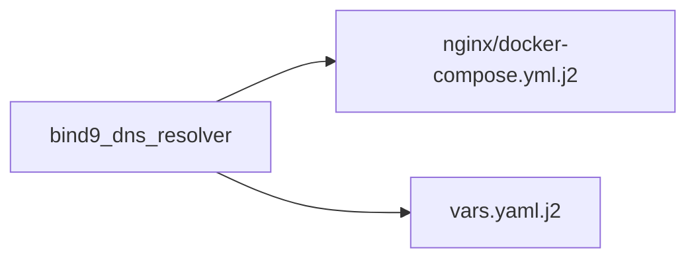

### Variable: `bind9_doh_port`

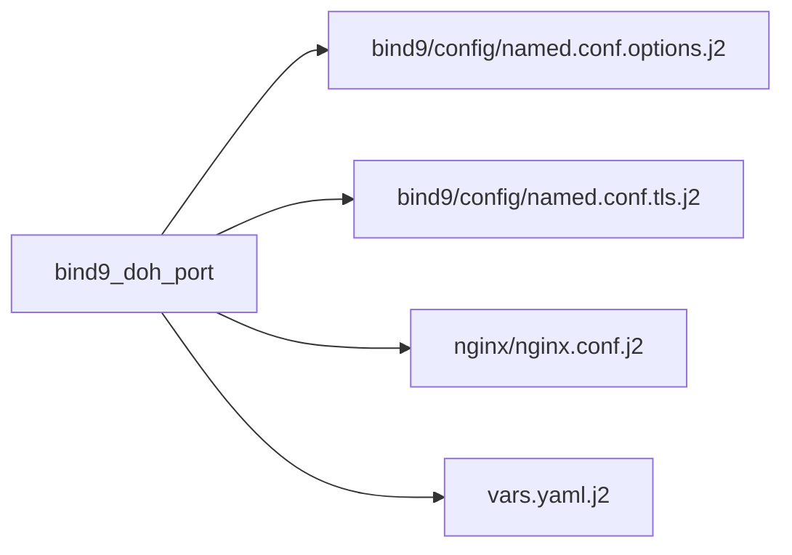

### Variable: `bind_acls`

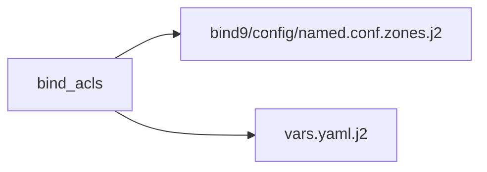

### Variable: `bind_dns_port`

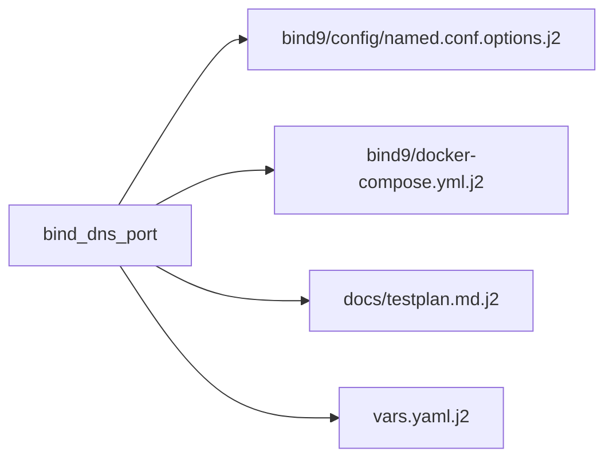

### Variable: `byoc`

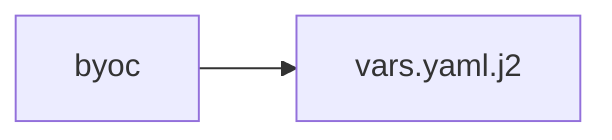

### Variable: `ca_crt_path`

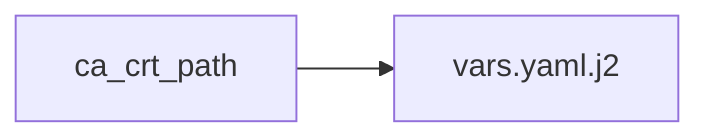

### Variable: `ca_name`

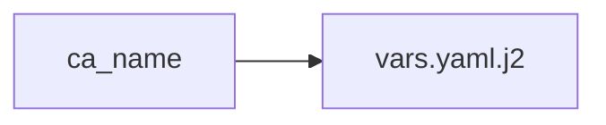

### Variable: `cert_acme_lifetime_hours`

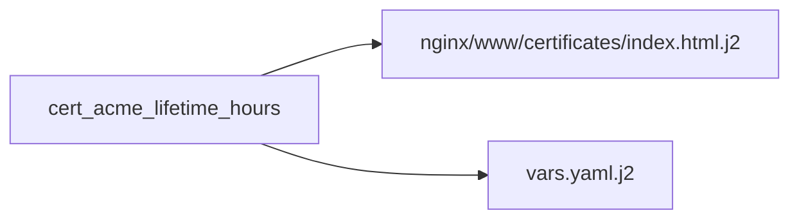

### Variable: `cert_city`

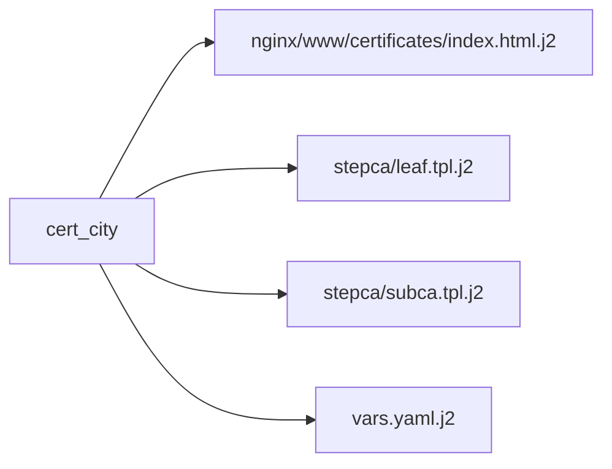

### Variable: `cert_country`

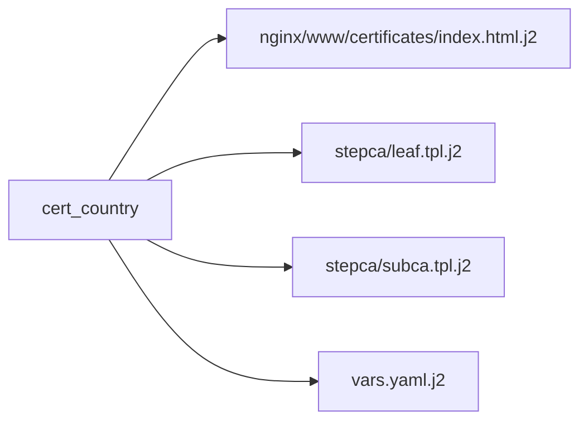

### Variable: `cert_intermediate_days`

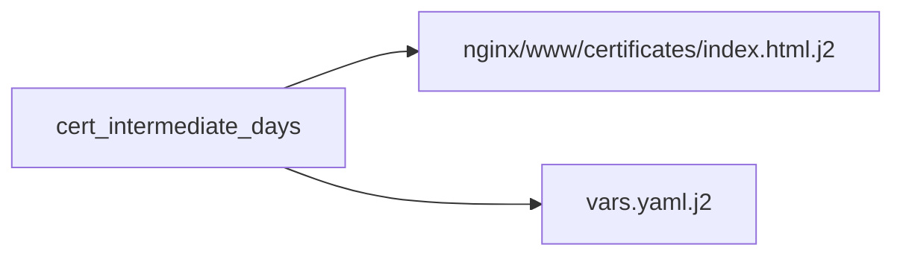

### Variable: `cert_intermediate_digest`

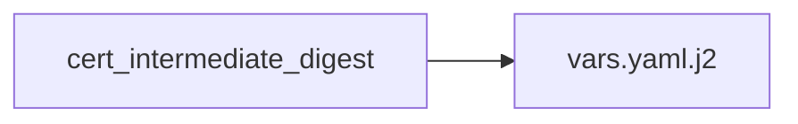

### Variable: `cert_intermediate_key_param`

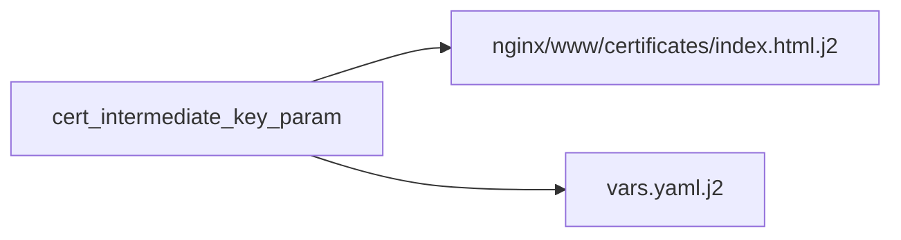

### Variable: `cert_intermediate_key_type`

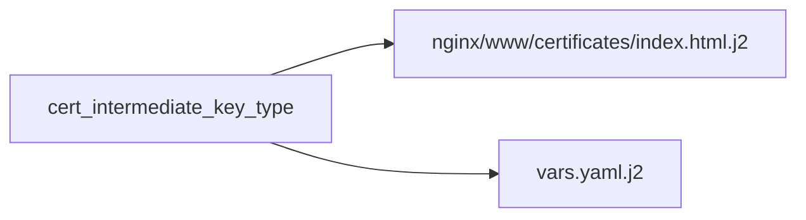

### Variable: `cert_org`

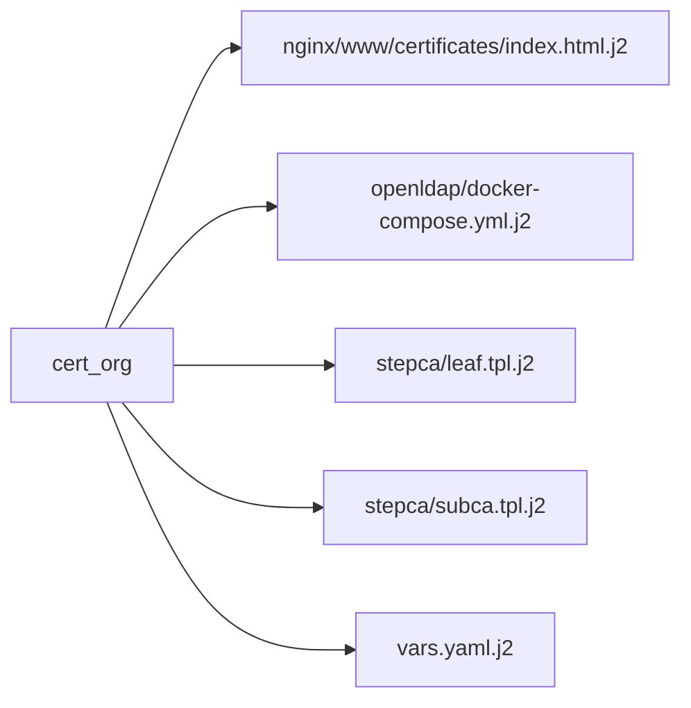

### Variable: `cert_ou`

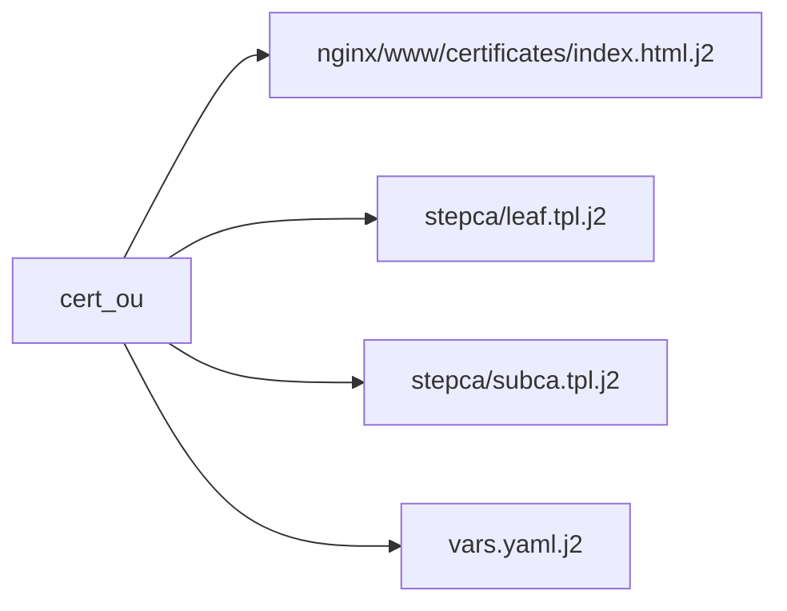

### Variable: `cert_province`


### Variable: `cert_root_ca_days`

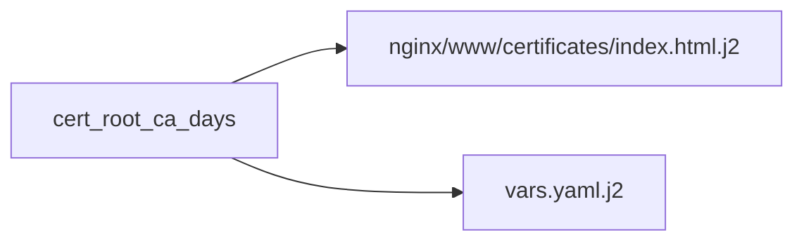

### Variable: `cert_root_digest`

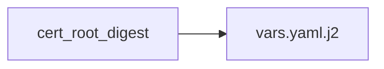

### Variable: `cert_root_key_param`

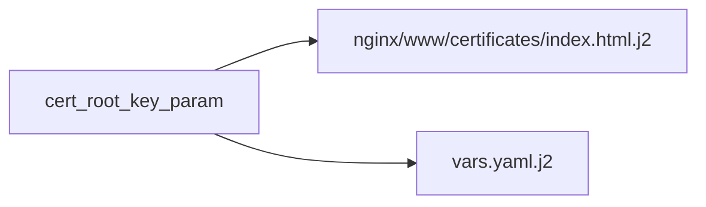

### Variable: `cert_root_key_type`

```mermaid
flowchart LR
    var["cert_root_key_type"]
    nginx_www_certificates_index_html_j2["nginx/www/certificates/index.html.j2"]
    var --> nginx_www_certificates_index_html_j2
    vars_yaml_j2["vars.yaml.j2"]
    var --> vars_yaml_j2
```

### Variable: `cert_service_days`

```mermaid
flowchart LR
    var["cert_service_days"]
    vars_yaml_j2["vars.yaml.j2"]
    var --> vars_yaml_j2
```

### Variable: `cname_ca`

```mermaid
flowchart LR
    var["cname_ca"]
    vars_yaml_j2["vars.yaml.j2"]
    var --> vars_yaml_j2
```

### Variable: `cname_dns`

```mermaid
flowchart LR
    var["cname_dns"]
    vars_yaml_j2["vars.yaml.j2"]
    var --> vars_yaml_j2
```

### Variable: `cname_ldap`

```mermaid
flowchart LR
    var["cname_ldap"]
    vars_yaml_j2["vars.yaml.j2"]
    var --> vars_yaml_j2
```

### Variable: `cname_sso`

```mermaid
flowchart LR
    var["cname_sso"]
    vars_yaml_j2["vars.yaml.j2"]
    var --> vars_yaml_j2
```

### Variable: `compose_file`

```mermaid
flowchart LR
    var["compose_file"]
    vars_yaml_j2["vars.yaml.j2"]
    var --> vars_yaml_j2
```

### Variable: `core_subnet`

```mermaid
flowchart LR
    var["core_subnet"]
    vars_yaml_j2["vars.yaml.j2"]
    var --> vars_yaml_j2
```

### Variable: `deploy_base_dir`

```mermaid
flowchart LR
    var["deploy_base_dir"]
    bind9_docker_compose_yml_j2["bind9/docker-compose.yml.j2"]
    var --> bind9_docker_compose_yml_j2
    docs_testplan_md_j2["docs/testplan.md.j2"]
    var --> docs_testplan_md_j2
    keycloak_docker_compose_yml_j2["keycloak/docker-compose.yml.j2"]
    var --> keycloak_docker_compose_yml_j2
    nginx_docker_compose_yml_j2["nginx/docker-compose.yml.j2"]
    var --> nginx_docker_compose_yml_j2
    openldap_docker_compose_yml_j2["openldap/docker-compose.yml.j2"]
    var --> openldap_docker_compose_yml_j2
    postgres_docker_compose_yml_j2["postgres/docker-compose.yml.j2"]
    var --> postgres_docker_compose_yml_j2
    stepca_docker_compose_yml_j2["stepca/docker-compose.yml.j2"]
    var --> stepca_docker_compose_yml_j2
    systemd_wrapper_service_j2["systemd/wrapper.service.j2"]
    var --> systemd_wrapper_service_j2
    vars_yaml_j2["vars.yaml.j2"]
    var --> vars_yaml_j2
```

### Variable: `dns`

```mermaid
flowchart LR
    var["dns"]
    nginx_www_landing_index_html_j2["nginx/www/landing/index.html.j2"]
    var --> nginx_www_landing_index_html_j2
```

### Variable: `dns_server`

```mermaid
flowchart LR
    var["dns_server"]
    vars_yaml_j2["vars.yaml.j2"]
    var --> vars_yaml_j2
```

### Variable: `domain`

```mermaid
flowchart LR
    var["domain"]
    bind9_data_reverse_zone_j2["bind9/data/reverse-zone.j2"]
    var --> bind9_data_reverse_zone_j2
    bind9_data_zone_j2["bind9/data/zone.j2"]
    var --> bind9_data_zone_j2
    docs_testplan_md_j2["docs/testplan.md.j2"]
    var --> docs_testplan_md_j2
    nginx_www_certificates_index_html_j2["nginx/www/certificates/index.html.j2"]
    var --> nginx_www_certificates_index_html_j2
    nginx_www_certificates_install_certs_sh_j2["nginx/www/certificates/install-certs.sh.j2"]
    var --> nginx_www_certificates_install_certs_sh_j2
    openldap_docker_compose_yml_j2["openldap/docker-compose.yml.j2"]
    var --> openldap_docker_compose_yml_j2
    vars_yaml_j2["vars.yaml.j2"]
    var --> vars_yaml_j2
```

### Variable: `domain_file`

```mermaid
flowchart LR
    var["domain_file"]
    nginx_nginx_conf_j2["nginx/nginx.conf.j2"]
    var --> nginx_nginx_conf_j2
    nginx_www_certificates_index_html_j2["nginx/www/certificates/index.html.j2"]
    var --> nginx_www_certificates_index_html_j2
    nginx_www_certificates_install_all_ubuntu_sh_j2["nginx/www/certificates/install-all-ubuntu.sh.j2"]
    var --> nginx_www_certificates_install_all_ubuntu_sh_j2
    nginx_www_certificates_install_certs_sh_j2["nginx/www/certificates/install-certs.sh.j2"]
    var --> nginx_www_certificates_install_certs_sh_j2
    vars_yaml_j2["vars.yaml.j2"]
    var --> vars_yaml_j2
```

### Variable: `enforce_ldaps`

```mermaid
flowchart LR
    var["enforce_ldaps"]
    openldap_docker_compose_yml_j2["openldap/docker-compose.yml.j2"]
    var --> openldap_docker_compose_yml_j2
    vars_yaml_j2["vars.yaml.j2"]
    var --> vars_yaml_j2
```

### Variable: `friendly_name`

```mermaid
flowchart LR
    var["friendly_name"]
    nginx_www_certificates_index_html_j2["nginx/www/certificates/index.html.j2"]
    var --> nginx_www_certificates_index_html_j2
    nginx_www_certificates_install_certs_sh_j2["nginx/www/certificates/install-certs.sh.j2"]
    var --> nginx_www_certificates_install_certs_sh_j2
    nginx_www_certificates_install_chrome_ubuntu_sh_j2["nginx/www/certificates/install-chrome-ubuntu.sh.j2"]
    var --> nginx_www_certificates_install_chrome_ubuntu_sh_j2
    nginx_www_certificates_install_firefox_ubuntu_sh_j2["nginx/www/certificates/install-firefox-ubuntu.sh.j2"]
    var --> nginx_www_certificates_install_firefox_ubuntu_sh_j2
    nginx_www_certificates_install_python_ubuntu_sh_j2["nginx/www/certificates/install-python-ubuntu.sh.j2"]
    var --> nginx_www_certificates_install_python_ubuntu_sh_j2
    nginx_www_landing_index_html_j2["nginx/www/landing/index.html.j2"]
    var --> nginx_www_landing_index_html_j2
    nginx_www_manual_index_html_j2["nginx/www/manual/index.html.j2"]
    var --> nginx_www_manual_index_html_j2
    vars_yaml_j2["vars.yaml.j2"]
    var --> vars_yaml_j2
```

### Variable: `host_ip`

```mermaid
flowchart LR
    var["host_ip"]
    bind9_data_zone_j2["bind9/data/zone.j2"]
    var --> bind9_data_zone_j2
    docs_testplan_md_j2["docs/testplan.md.j2"]
    var --> docs_testplan_md_j2
    nginx_docker_compose_yml_j2["nginx/docker-compose.yml.j2"]
    var --> nginx_docker_compose_yml_j2
    vars_yaml_j2["vars.yaml.j2"]
    var --> vars_yaml_j2
```

### Variable: `hostname`

```mermaid
flowchart LR
    var["hostname"]
    vars_yaml_j2["vars.yaml.j2"]
    var --> vars_yaml_j2
```

### Variable: `hostname_bind9`

```mermaid
flowchart LR
    var["hostname_bind9"]
    bind9_docker_compose_yml_j2["bind9/docker-compose.yml.j2"]
    var --> bind9_docker_compose_yml_j2
    nginx_bind9_conf_j2["nginx/bind9.conf.j2"]
    var --> nginx_bind9_conf_j2
    nginx_nginx_conf_j2["nginx/nginx.conf.j2"]
    var --> nginx_nginx_conf_j2
    nginx_www_landing_index_html_j2["nginx/www/landing/index.html.j2"]
    var --> nginx_www_landing_index_html_j2
    vars_yaml_j2["vars.yaml.j2"]
    var --> vars_yaml_j2
```

### Variable: `hostname_certs`

```mermaid
flowchart LR
    var["hostname_certs"]
    nginx_www_certificates_index_html_j2["nginx/www/certificates/index.html.j2"]
    var --> nginx_www_certificates_index_html_j2
    nginx_www_certificates_install_all_ubuntu_sh_j2["nginx/www/certificates/install-all-ubuntu.sh.j2"]
    var --> nginx_www_certificates_install_all_ubuntu_sh_j2
    nginx_www_certificates_install_certs_sh_j2["nginx/www/certificates/install-certs.sh.j2"]
    var --> nginx_www_certificates_install_certs_sh_j2
```

### Variable: `hostname_keycloak`

```mermaid
flowchart LR
    var["hostname_keycloak"]
    keycloak_docker_compose_yml_j2["keycloak/docker-compose.yml.j2"]
    var --> keycloak_docker_compose_yml_j2
    nginx_nginx_conf_j2["nginx/nginx.conf.j2"]
    var --> nginx_nginx_conf_j2
    nginx_www_landing_index_html_j2["nginx/www/landing/index.html.j2"]
    var --> nginx_www_landing_index_html_j2
    vars_yaml_j2["vars.yaml.j2"]
    var --> vars_yaml_j2
```

### Variable: `hostname_landing`

```mermaid
flowchart LR
    var["hostname_landing"]
    nginx_nginx_conf_j2["nginx/nginx.conf.j2"]
    var --> nginx_nginx_conf_j2
    vars_yaml_j2["vars.yaml.j2"]
    var --> vars_yaml_j2
```

### Variable: `hostname_ldap`

```mermaid
flowchart LR
    var["hostname_ldap"]
    nginx_nginx_conf_j2["nginx/nginx.conf.j2"]
    var --> nginx_nginx_conf_j2
    nginx_www_landing_index_html_j2["nginx/www/landing/index.html.j2"]
    var --> nginx_www_landing_index_html_j2
    openldap_docker_compose_yml_j2["openldap/docker-compose.yml.j2"]
    var --> openldap_docker_compose_yml_j2
    vars_yaml_j2["vars.yaml.j2"]
    var --> vars_yaml_j2
```

### Variable: `hostname_nginx`

```mermaid
flowchart LR
    var["hostname_nginx"]
    nginx_docker_compose_yml_j2["nginx/docker-compose.yml.j2"]
    var --> nginx_docker_compose_yml_j2
    vars_yaml_j2["vars.yaml.j2"]
    var --> vars_yaml_j2
```

### Variable: `hostname_stepca`

```mermaid
flowchart LR
    var["hostname_stepca"]
    nginx_nginx_conf_j2["nginx/nginx.conf.j2"]
    var --> nginx_nginx_conf_j2
    nginx_www_landing_index_html_j2["nginx/www/landing/index.html.j2"]
    var --> nginx_www_landing_index_html_j2
    stepca_docker_compose_yml_j2["stepca/docker-compose.yml.j2"]
    var --> stepca_docker_compose_yml_j2
    vars_yaml_j2["vars.yaml.j2"]
    var --> vars_yaml_j2
```

### Variable: `ica_crt_path`

```mermaid
flowchart LR
    var["ica_crt_path"]
    vars_yaml_j2["vars.yaml.j2"]
    var --> vars_yaml_j2
```

### Variable: `image_bind9`

```mermaid
flowchart LR
    var["image_bind9"]
    bind9_docker_compose_yml_j2["bind9/docker-compose.yml.j2"]
    var --> bind9_docker_compose_yml_j2
    vars_yaml_j2["vars.yaml.j2"]
    var --> vars_yaml_j2
```

### Variable: `image_keycloak`

```mermaid
flowchart LR
    var["image_keycloak"]
    keycloak_docker_compose_yml_j2["keycloak/docker-compose.yml.j2"]
    var --> keycloak_docker_compose_yml_j2
    vars_yaml_j2["vars.yaml.j2"]
    var --> vars_yaml_j2
```

### Variable: `image_nginx`

```mermaid
flowchart LR
    var["image_nginx"]
    nginx_docker_compose_yml_j2["nginx/docker-compose.yml.j2"]
    var --> nginx_docker_compose_yml_j2
    vars_yaml_j2["vars.yaml.j2"]
    var --> vars_yaml_j2
```

### Variable: `image_openldap`

```mermaid
flowchart LR
    var["image_openldap"]
    openldap_docker_compose_yml_j2["openldap/docker-compose.yml.j2"]
    var --> openldap_docker_compose_yml_j2
    vars_yaml_j2["vars.yaml.j2"]
    var --> vars_yaml_j2
```

### Variable: `image_postgres`

```mermaid
flowchart LR
    var["image_postgres"]
    postgres_docker_compose_yml_j2["postgres/docker-compose.yml.j2"]
    var --> postgres_docker_compose_yml_j2
    vars_yaml_j2["vars.yaml.j2"]
    var --> vars_yaml_j2
```

### Variable: `image_stepca`

```mermaid
flowchart LR
    var["image_stepca"]
    stepca_docker_compose_yml_j2["stepca/docker-compose.yml.j2"]
    var --> stepca_docker_compose_yml_j2
    vars_yaml_j2["vars.yaml.j2"]
    var --> vars_yaml_j2
```

### Variable: `install_keycloak`

```mermaid
flowchart LR
    var["install_keycloak"]
    nginx_nginx_conf_j2["nginx/nginx.conf.j2"]
    var --> nginx_nginx_conf_j2
    nginx_www_landing_index_html_j2["nginx/www/landing/index.html.j2"]
    var --> nginx_www_landing_index_html_j2
    vars_yaml_j2["vars.yaml.j2"]
    var --> vars_yaml_j2
```

### Variable: `install_ldap`

```mermaid
flowchart LR
    var["install_ldap"]
    vars_yaml_j2["vars.yaml.j2"]
    var --> vars_yaml_j2
```

### Variable: `ip_bind9`

```mermaid
flowchart LR
    var["ip_bind9"]
    bind9_docker_compose_yml_j2["bind9/docker-compose.yml.j2"]
    var --> bind9_docker_compose_yml_j2
    stepca_docker_compose_yml_j2["stepca/docker-compose.yml.j2"]
    var --> stepca_docker_compose_yml_j2
    vars_yaml_j2["vars.yaml.j2"]
    var --> vars_yaml_j2
```

### Variable: `ip_keycloak`

```mermaid
flowchart LR
    var["ip_keycloak"]
    keycloak_docker_compose_yml_j2["keycloak/docker-compose.yml.j2"]
    var --> keycloak_docker_compose_yml_j2
    vars_yaml_j2["vars.yaml.j2"]
    var --> vars_yaml_j2
```

### Variable: `ip_ldap`

```mermaid
flowchart LR
    var["ip_ldap"]
    openldap_docker_compose_yml_j2["openldap/docker-compose.yml.j2"]
    var --> openldap_docker_compose_yml_j2
    vars_yaml_j2["vars.yaml.j2"]
    var --> vars_yaml_j2
```

### Variable: `ip_nginx`

```mermaid
flowchart LR
    var["ip_nginx"]
    nginx_docker_compose_yml_j2["nginx/docker-compose.yml.j2"]
    var --> nginx_docker_compose_yml_j2
    vars_yaml_j2["vars.yaml.j2"]
    var --> vars_yaml_j2
```

### Variable: `ip_postgres`

```mermaid
flowchart LR
    var["ip_postgres"]
    postgres_docker_compose_yml_j2["postgres/docker-compose.yml.j2"]
    var --> postgres_docker_compose_yml_j2
    vars_yaml_j2["vars.yaml.j2"]
    var --> vars_yaml_j2
```

### Variable: `ip_stepca`

```mermaid
flowchart LR
    var["ip_stepca"]
    stepca_docker_compose_yml_j2["stepca/docker-compose.yml.j2"]
    var --> stepca_docker_compose_yml_j2
    vars_yaml_j2["vars.yaml.j2"]
    var --> vars_yaml_j2
```

### Variable: `keycloak_data_dir`

```mermaid
flowchart LR
    var["keycloak_data_dir"]
    keycloak_docker_compose_yml_j2["keycloak/docker-compose.yml.j2"]
    var --> keycloak_docker_compose_yml_j2
    vars_yaml_j2["vars.yaml.j2"]
    var --> vars_yaml_j2
```

### Variable: `lan_cidr`

```mermaid
flowchart LR
    var["lan_cidr"]
    docs_testplan_md_j2["docs/testplan.md.j2"]
    var --> docs_testplan_md_j2
    vars_yaml_j2["vars.yaml.j2"]
    var --> vars_yaml_j2
```

### Variable: `lan_gateway`

```mermaid
flowchart LR
    var["lan_gateway"]
    vars_yaml_j2["vars.yaml.j2"]
    var --> vars_yaml_j2
```

### Variable: `landing_page_cname`

```mermaid
flowchart LR
    var["landing_page_cname"]
    vars_yaml_j2["vars.yaml.j2"]
    var --> vars_yaml_j2
```

### Variable: `ldap_base_dn`

```mermaid
flowchart LR
    var["ldap_base_dn"]
    openldap_02_ous_ldif_j2["openldap/02-ous.ldif.j2"]
    var --> openldap_02_ous_ldif_j2
    openldap_03_groups_ldif_j2["openldap/03-groups.ldif.j2"]
    var --> openldap_03_groups_ldif_j2
    openldap_05_admins_ldif_j2["openldap/05-admins.ldif.j2"]
    var --> openldap_05_admins_ldif_j2
    openldap_06_acl_ldif_j2["openldap/06-acl.ldif.j2"]
    var --> openldap_06_acl_ldif_j2
    openldap_base_ldif_j2["openldap/base.ldif.j2"]
    var --> openldap_base_ldif_j2
    openldap_docker_compose_yml_j2["openldap/docker-compose.yml.j2"]
    var --> openldap_docker_compose_yml_j2
```

### Variable: `ldap_domain_components`

```mermaid
flowchart LR
    var["ldap_domain_components"]
    openldap_base_ldif_j2["openldap/base.ldif.j2"]
    var --> openldap_base_ldif_j2
```

### Variable: `ldap_groups`

```mermaid
flowchart LR
    var["ldap_groups"]
    openldap_03_groups_ldif_j2["openldap/03-groups.ldif.j2"]
    var --> openldap_03_groups_ldif_j2
    vars_yaml_j2["vars.yaml.j2"]
    var --> vars_yaml_j2
```

### Variable: `ldap_organizational_units`

```mermaid
flowchart LR
    var["ldap_organizational_units"]
    openldap_02_ous_ldif_j2["openldap/02-ous.ldif.j2"]
    var --> openldap_02_ous_ldif_j2
    vars_yaml_j2["vars.yaml.j2"]
    var --> vars_yaml_j2
```

### Variable: `nginx_backend_ldap`

```mermaid
flowchart LR
    var["nginx_backend_ldap"]
    nginx_nginx_conf_j2["nginx/nginx.conf.j2"]
    var --> nginx_nginx_conf_j2
    vars_yaml_j2["vars.yaml.j2"]
    var --> vars_yaml_j2
```

### Variable: `nginx_backend_stepca`

```mermaid
flowchart LR
    var["nginx_backend_stepca"]
    nginx_nginx_conf_j2["nginx/nginx.conf.j2"]
    var --> nginx_nginx_conf_j2
    vars_yaml_j2["vars.yaml.j2"]
    var --> vars_yaml_j2
```

### Variable: `postgres_data_dir`

```mermaid
flowchart LR
    var["postgres_data_dir"]
    postgres_docker_compose_yml_j2["postgres/docker-compose.yml.j2"]
    var --> postgres_docker_compose_yml_j2
    vars_yaml_j2["vars.yaml.j2"]
    var --> vars_yaml_j2
```

### Variable: `project_containers`

```mermaid
flowchart LR
    var["project_containers"]
    vars_yaml_j2["vars.yaml.j2"]
    var --> vars_yaml_j2
```

### Variable: `repo_source`

```mermaid
flowchart LR
    var["repo_source"]
    vars_yaml_j2["vars.yaml.j2"]
    var --> vars_yaml_j2
```

### Variable: `reverse_zone_names`

```mermaid
flowchart LR
    var["reverse_zone_names"]
    bind9_config_named_conf_zones_j2["bind9/config/named.conf.zones.j2"]
    var --> bind9_config_named_conf_zones_j2
```

### Variable: `root_cert_name`

```mermaid
flowchart LR
    var["root_cert_name"]
    nginx_nginx_conf_j2["nginx/nginx.conf.j2"]
    var --> nginx_nginx_conf_j2
    nginx_www_certificates_index_html_j2["nginx/www/certificates/index.html.j2"]
    var --> nginx_www_certificates_index_html_j2
    nginx_www_certificates_install_certs_sh_j2["nginx/www/certificates/install-certs.sh.j2"]
    var --> nginx_www_certificates_install_certs_sh_j2
    nginx_www_certificates_install_chrome_ubuntu_sh_j2["nginx/www/certificates/install-chrome-ubuntu.sh.j2"]
    var --> nginx_www_certificates_install_chrome_ubuntu_sh_j2
    nginx_www_certificates_install_firefox_ubuntu_sh_j2["nginx/www/certificates/install-firefox-ubuntu.sh.j2"]
    var --> nginx_www_certificates_install_firefox_ubuntu_sh_j2
    nginx_www_certificates_install_python_ubuntu_sh_j2["nginx/www/certificates/install-python-ubuntu.sh.j2"]
    var --> nginx_www_certificates_install_python_ubuntu_sh_j2
    vars_yaml_j2["vars.yaml.j2"]
    var --> vars_yaml_j2
```

### Variable: `service_dirs`

```mermaid
flowchart LR
    var["service_dirs"]
    vars_yaml_j2["vars.yaml.j2"]
    var --> vars_yaml_j2
```

### Variable: `service_users`

```mermaid
flowchart LR
    var["service_users"]
    bind9_docker_compose_yml_j2["bind9/docker-compose.yml.j2"]
    var --> bind9_docker_compose_yml_j2
    keycloak_docker_compose_yml_j2["keycloak/docker-compose.yml.j2"]
    var --> keycloak_docker_compose_yml_j2
    nginx_docker_compose_yml_j2["nginx/docker-compose.yml.j2"]
    var --> nginx_docker_compose_yml_j2
    nginx_nginx_conf_j2["nginx/nginx.conf.j2"]
    var --> nginx_nginx_conf_j2
    postgres_docker_compose_yml_j2["postgres/docker-compose.yml.j2"]
    var --> postgres_docker_compose_yml_j2
    stepca_docker_compose_yml_j2["stepca/docker-compose.yml.j2"]
    var --> stepca_docker_compose_yml_j2
    vars_yaml_j2["vars.yaml.j2"]
    var --> vars_yaml_j2
```

### Variable: `stepca_cert_allow_subordinate_ca`

```mermaid
flowchart LR
    var["stepca_cert_allow_subordinate_ca"]
    vars_yaml_j2["vars.yaml.j2"]
    var --> vars_yaml_j2
```

### Variable: `stepca_cert_max_lifetime_hours`

```mermaid
flowchart LR
    var["stepca_cert_max_lifetime_hours"]
    vars_yaml_j2["vars.yaml.j2"]
    var --> vars_yaml_j2
```

### Variable: `stepca_port`

```mermaid
flowchart LR
    var["stepca_port"]
    nginx_nginx_conf_j2["nginx/nginx.conf.j2"]
    var --> nginx_nginx_conf_j2
    stepca_docker_compose_yml_j2["stepca/docker-compose.yml.j2"]
    var --> stepca_docker_compose_yml_j2
    vars_yaml_j2["vars.yaml.j2"]
    var --> vars_yaml_j2
```

### Variable: `system_timezone`

```mermaid
flowchart LR
    var["system_timezone"]
    vars_yaml_j2["vars.yaml.j2"]
    var --> vars_yaml_j2
```

### Variable: `tsig_keys`

```mermaid
flowchart LR
    var["tsig_keys"]
    bind9_config_named_conf_acl_j2["bind9/config/named.conf.acl.j2"]
    var --> bind9_config_named_conf_acl_j2
    bind9_config_named_conf_keys_j2["bind9/config/named.conf.keys.j2"]
    var --> bind9_config_named_conf_keys_j2
    bind9_config_named_conf_zones_j2["bind9/config/named.conf.zones.j2"]
    var --> bind9_config_named_conf_zones_j2
    vars_yaml_j2["vars.yaml.j2"]
    var --> vars_yaml_j2
```

### Variable: `use_host_dns`

```mermaid
flowchart LR
    var["use_host_dns"]
    vars_yaml_j2["vars.yaml.j2"]
    var --> vars_yaml_j2
```

### Variable: `vendor`

```mermaid
flowchart LR
    var["vendor"]
    nginx_www_certificates_index_html_j2["nginx/www/certificates/index.html.j2"]
    var --> nginx_www_certificates_index_html_j2
    nginx_www_landing_index_html_j2["nginx/www/landing/index.html.j2"]
    var --> nginx_www_landing_index_html_j2
    nginx_www_manual_index_html_j2["nginx/www/manual/index.html.j2"]
    var --> nginx_www_manual_index_html_j2
    vars_yaml_j2["vars.yaml.j2"]
    var --> vars_yaml_j2
```

